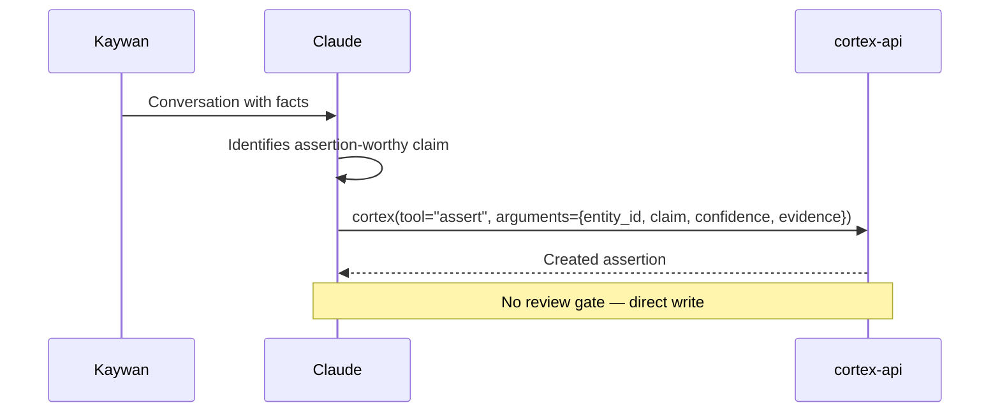
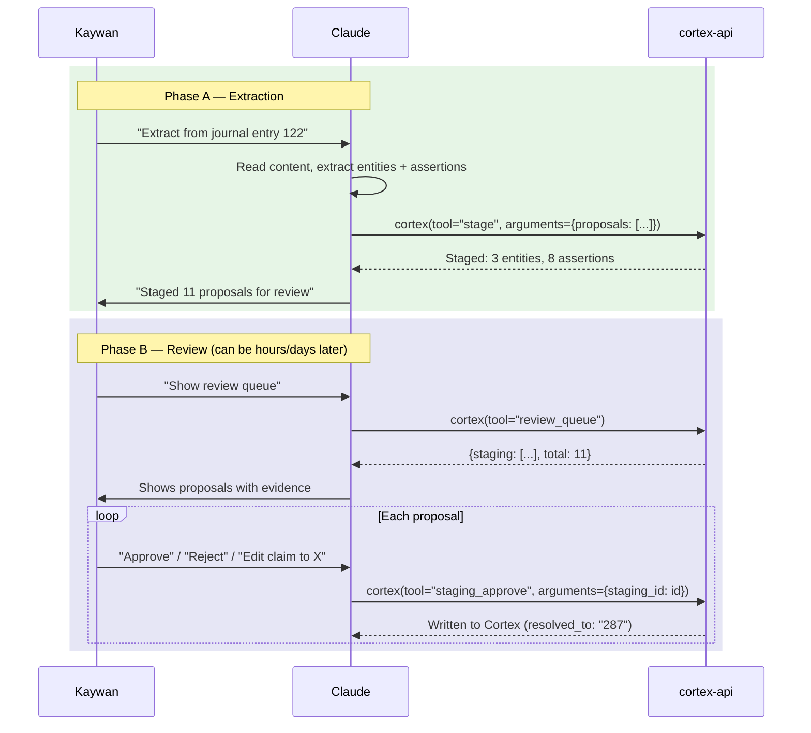
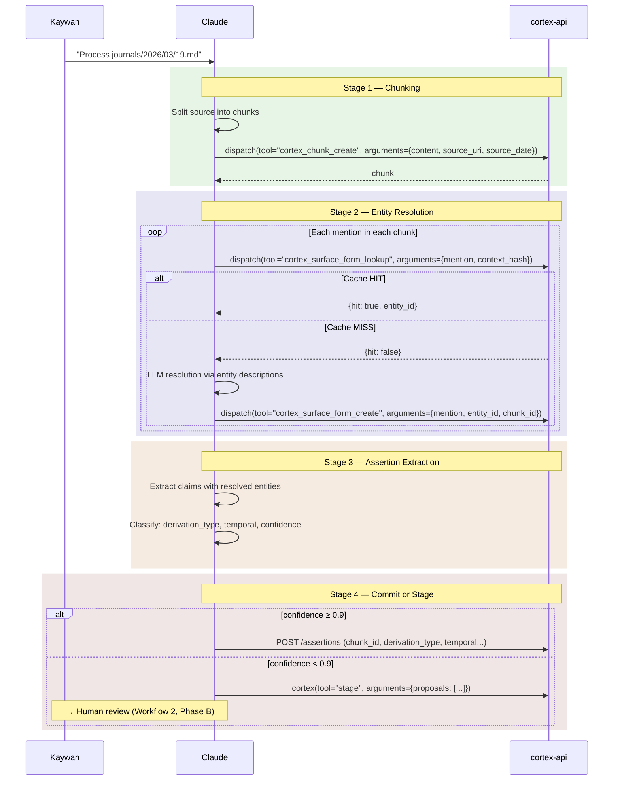
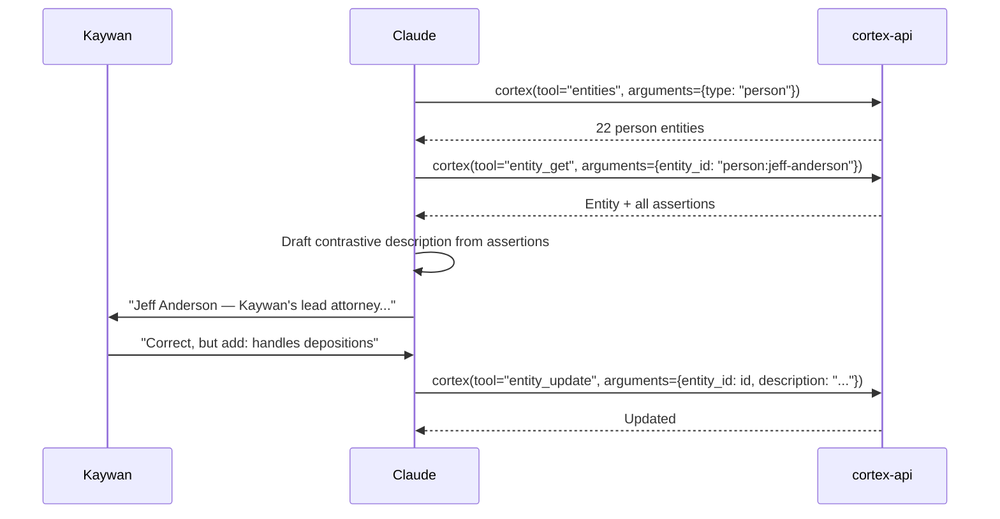

# Cortex v2 — Architecture & MCP Tooling Reference

## Overview

Cortex is the persistent knowledge system shared across all Claude agents.
v2 adds full provenance tracking, temporal modeling, entity resolution
infrastructure, and a staging workflow for human-reviewed extractions.

**Design thesis:** For a bounded domain (~120 entities) with a single trusted
operator, LLMs perform entity resolution via reading comprehension using
contrastive entity descriptions — no embeddings, no multi-observer voting.

**Research foundation:** 13 research pillars (TROVE derivation taxonomy,
PROV-DM temporal model, Toulmin argumentation, zero-shot entity linking,
confidence-gated curation). Full spec: `tasks/drafts/cortex-v2-synthesis.md`.

---

## Schema (Migration 003)

### entities

| Column | Type | v2? | Description |
|---|---|---|---|
| id | TEXT PK | | `type:slug` format (e.g. `person:jeff-anderson`) |
| type | TEXT | | person, organization, legal_matter, event, etc. |
| name | TEXT | | Display name |
| **description** | TEXT | **v2** | Contrastive description for entity resolution |
| **status** | TEXT | **v2** | confirmed / provisional / merged / deprecated |
| aliases | TEXT | | JSON array of alternate names |
| attributes | TEXT | | JSON object of structured properties |
| notes | TEXT | | Free-text notes |
| source_uri | TEXT | | Provenance URI |
| created_at, updated_at | TEXT | | Timestamps |

### assertions

| Column | Type | v2? | Description |
|---|---|---|---|
| id | INTEGER PK | | Auto-increment |
| entity_id | TEXT FK | | Target entity |
| claim | TEXT | | The factual assertion |
| confidence | TEXT | | confirmed / believed / suspected / hypothesized |
| evidence | TEXT | | Why — basis for the claim |
| evidence_uris | TEXT | | JSON array of source URIs |
| chunk_id | INTEGER FK | | Source chunk (provenance anchor) |
| **derivation_type** | TEXT | **v2** | quotation / compression / inference / other |
| **reasoning_summary** | TEXT | **v2** | The warrant — why this claim is supported |
| **observed_at** | TEXT | **v2** | When we observed/extracted this |
| **valid_from** | TEXT | **v2** | When true in the world (start) |
| **valid_until** | TEXT | **v2** | When true in the world (end, NULL = ongoing) |
| **validity_precision** | TEXT | **v2** | exact / approximate / inferred |
| **confidence_score** | REAL | **v2** | 0.0–1.0 numeric (extraction-time metadata) |
| **temporal_type** | TEXT | **v2** | event / state / unknown |
| **is_atomic** | INTEGER | **v2** | Single fact per claim |
| **is_decontextualized** | INTEGER | **v2** | Pronouns replaced, context-free |
| **review_notes** | TEXT | **v2** | Human reviewer comments |
| human_reviewed | BOOLEAN | | Whether a human has reviewed |
| superseded_by | INTEGER FK | | Points to correcting assertion |
| superseded_at | TEXT | | When superseded |

**Confidence authority:** `confidence` (text) is authoritative. `confidence_score`
(float) is extraction-time metadata that does not change after creation.

### chunks

Source text units that assertions trace back to.

| Column | Type | Description |
|---|---|---|
| id | INTEGER PK | Auto-increment |
| content | TEXT | The source text |
| source_uri | TEXT | Path to source document |
| source_hash | TEXT | Content hash for deduplication |
| source_date | DATE | Date of the source material |
| chunk_index | INTEGER | Position within the source |
| offset_start, offset_end | INTEGER | Character offsets |
| observer | TEXT | Who created this chunk |
| model_version | TEXT | Model used for extraction |
| created_at | TEXT | Timestamp |

### surface_forms

Entity mention resolution cache. Once a mention is resolved in context,
identical future mentions resolve without an LLM call.

| Column | Type | Description |
|---|---|---|
| id | INTEGER PK | Auto-increment |
| entity_id | TEXT FK | Resolved entity |
| form | TEXT | The mention text (legacy column) |
| mention | TEXT | The mention text (v2 column) |
| chunk_id | INTEGER FK | Source chunk |
| span_start, span_end | INTEGER | Character offsets in chunk |
| context_hash | TEXT | SHA-256 of lowercase(mention) + context |
| resolution_confidence | REAL | 0.0–1.0 |
| resolution_reasoning | TEXT | Why this resolution was chosen |
| entity_type_hint | TEXT | person / organization / etc. |
| created_at | TEXT | Timestamp |

### extraction_staging

Human-review queue for proposed entities and assertions.

| Column | Type | Description |
|---|---|---|
| id | INTEGER PK | Auto-increment |
| source_uri | TEXT | Provenance (e.g. `journal-bridge:entry:122`) |
| proposal_type | TEXT | entity / assertion |
| proposal_action | TEXT | add / revise / remove |
| target_id | TEXT | For revise/remove: existing entity/assertion ID |
| proposal_json | TEXT | Full payload as JSON |
| chunk_id | INTEGER FK | Source chunk reference |
| status | TEXT | pending / approved / rejected / merged |
| resolved_to | TEXT | Created entity/assertion ID after approval |
| reviewer | TEXT | Who reviewed |
| reviewed_at | TEXT | When reviewed |
| created_at | TEXT | Timestamp |

---

## Temporal Model — The Three Times

| Time | Column | Meaning |
|---|---|---|
| **Transaction** | `created_at` | When the record entered the database |
| **Observation** | `observed_at` | When we observed/extracted this (e.g. journal date) |
| **Validity** | `valid_from` / `valid_until` | When true in the world |

**Critical invariant:** Supersession ≠ validity-end.

- **Correction** (we were wrong): supersede the old assertion
- **World changed** (it was true, now it's not): set `valid_until`, do NOT supersede

### Temporal Query Semantics

| Query parameter | Meaning | SQL filter |
|---|---|---|
| `valid_at=YYYY-MM-DD` | What was true on that date | `valid_from <= ? AND (valid_until IS NULL OR valid_until > ?)` |
| `known_at=YYYY-MM-DD` | What the DB had recorded by then | `created_at <= ? AND (superseded_at IS NULL OR superseded_at > ?)` |

---

## cortex-api REST Endpoints

**Service:** UDS at `/tmp/universal-protocol/cortex-api.sock`
**Container:** `network_mode: none` — no outbound network
**Rebuild:** `docker compose -f docker/compose/cortex-api.yml up -d --build`

### Entities

| Method | Path | Description |
|---|---|---|
| GET | `/entities?type=&limit=` | List entities |
| GET | `/entities/{id}` | Get entity with assertions |
| POST | `/entities` | Create entity |
| PATCH | `/entities/{id}` | Update description, status, notes |

### Assertions

| Method | Path | Description |
|---|---|---|
| GET | `/assertions?entity_id=&confidence=&superseded=&valid_at=&known_at=&limit=` | List with temporal filters |
| POST | `/assertions` | Create with full v2 provenance fields |

### Chunks

| Method | Path | Description |
|---|---|---|
| GET | `/chunks?source_uri=&source_date_from=&source_date_to=&observer=&limit=` | List chunks |
| GET | `/chunks/{id}` | Get chunk with content |
| POST | `/chunks` | Create chunk |

### Surface Forms

| Method | Path | Description |
|---|---|---|
| GET | `/surface-forms?mention=&entity_id=&chunk_id=&limit=` | List surface forms |
| GET | `/surface-forms/cache?mention=&context_hash=` | Cache lookup → entity_id |
| POST | `/surface-forms` | Create surface form |

### Staging

| Method | Path | Description |
|---|---|---|
| GET | `/staging?status=&source_uri=&limit=` | List proposals |
| GET | `/staging/{id}` | Get single proposal |
| POST | `/staging/batch` | Bulk-create proposals |
| POST | `/staging/{id}/approve` | Approve → writes to Cortex |
| POST | `/staging/{id}/reject` | Reject proposal |

### Other

| Method | Path | Description |
|---|---|---|
| GET | `/health` | Health check |
| GET/POST | `/todos`, PATCH `/todos/{id}` | Todo management |
| GET/POST | `/session-journals` | Session journal CRUD |
| GET | `/deadlines` | Legal deadlines view |

---

## MCP Tools

**Primary visibility rule:** the MCP server keeps the global primary tool count
≤ 24 because the web connector truncates tool visibility beyond that point.
Cortex currently uses two primary surfaces: `cortex(tool, arguments)` and
`cortex_boot(agent?)`.

### Primary Cortex-Related Tools (directly visible)

| Tool | Description |
|---|---|
| `cortex(tool, arguments)` | Unified Cortex surface for entities, assertions, deadlines, journals, review queue, stage, and staging approval |
| `cortex_boot(agent?)` | Boot briefing with deadlines, recent sessions, open investigations, agent-bus state, and review queue |

### Primary `cortex(...)` Subtools

Invoke these via `cortex(tool="name", arguments='{"param": "value"}')`.

| Subtool | Description |
|---|---|
| `entities(type?, limit?)` | List entities |
| `entity_get(entity_id)` | Get entity with assertions |
| `entity_update(entity_id, description?, status?, notes?)` | Update entity fields |
| `assertions(entity_id?, confidence?, limit?)` | List assertions |
| `assert(entity_id, claim, confidence, evidence, evidence_uris?)` | Seed an assertion |
| `deadlines()` | Legal deadlines |
| `journal_write(timestamp, agent, summary, ...)` | Create session journal |
| `journal_read(limit?)` | Read recent session journals |
| `review_queue(limit?)` | Unified queue: pending staging + low-confidence assertions |
| `stage(proposals)` | Batch-stage proposals for review |
| `staging_approve(staging_id, reviewer?)` | Approve proposal → Cortex |

### Dispatch-Only Cortex v2 Tools

Callable via `dispatch(tool="name", arguments='{"param": "value"}')`.

| Tool | Description |
|---|---|
| `cortex_chunk_create(content, source_uri?, source_date?, ...)` | Create source chunk |
| `cortex_chunk_get(chunk_id)` | Get chunk with content |
| `cortex_surface_form_create(mention, entity_id, chunk_id, ...)` | Create resolved mention |
| `cortex_surface_form_lookup(mention, context_hash)` | Cache lookup: mention → entity |
| `cortex_staging_list(status?, source_uri?, limit?)` | List staging proposals |
| `cortex_staging_reject(staging_id, reviewer?)` | Reject staging proposal |

### Examples

```python
cortex(tool="entities", arguments='{"type": "person", "limit": 20}')

cortex(tool="stage", arguments='{"proposals": [...]}')

dispatch(tool="cortex_chunk_create", arguments='{"content": "Journal text...", "source_uri": "journals/2026/01/15.md", "source_date": "2026-01-15"}')

dispatch(tool="cortex_surface_form_lookup", arguments='{"mention": "Jeff", "context_hash": "abc123..."}')
```

---

## Provenance Chain

```
Source Document
    │
    ▼
  chunk (atomic text unit, source_uri + source_date)
    │
    ├──► surface_form (mention → entity resolution, cached)
    │
    ▼
  assertion (claim + derivation_type + reasoning + temporal)
    │
    ├── confidence gating: ≥ 0.9 auto-commit, < 0.9 → staging
    │
    ▼
  staging (human review queue)
    │
    ├── approve → assertion with full provenance
    └── reject → discarded
```

## Staging Workflow

```
1. Extract: Claude reads source, proposes entities/assertions
2. Stage:   `cortex(tool="stage", arguments='{"proposals": [...]}')`
3. Review:  `cortex(tool="review_queue")` → see pending items
4. Approve: `cortex(tool="staging_approve", arguments='{"staging_id": N}')` → writes to Cortex with provenance
   OR
   Reject:  dispatch(tool="cortex_staging_reject", arguments='{"staging_id": N}')
```

Staging approval handles three actions:
- **add**: creates new entity/assertion with v2 fields
- **revise**: supersedes old assertion, creates corrected version
- **remove**: marks old assertion as superseded

---

## Entity Description Seeding

The `description` field enables reading-comprehension entity resolution.
Descriptions follow a contrastive pattern:

```
"{role/identity} — {distinguishing context}. Not to be confused with: {similar entities}."
```

**Example:**
> Jeff Anderson — Kaywan's lead attorney for CSAM litigation at Jeff Anderson
> & Associates since 2023. Manages depositions, discovery, and court filings.
> Not to be confused with corporate attorneys or other legal counsel.

Update via:
```python
cortex(tool="entity_update", arguments='{"entity_id": "person:jeff-anderson", "description": "..."}')
```

---

## Imprint Workflows

Four ways knowledge enters Cortex, each with different provenance depth.

### Workflow 1: Direct Assertion Seeding — LIVE

Claude observes something in conversation and records it immediately.
No chunks, no staging, no review. Used for session-end journaling,
decisions captured during agent-bus threads, and ad-hoc observations.

**Human orchestration: None required.**



### Workflow 2: Conversational Extraction → Staging — LIVE

Claude reads source material, extracts entities and assertions, stages
them for human review. This is the primary knowledge ingestion workflow.

**Human orchestration steps:**

1. **Kaywan** asks Claude to extract: *"Extract entities from journal entry 122"*
2. **Claude** reads content, identifies entities and assertions
3. **Claude** calls `cortex(tool="stage", arguments='{"proposals": [...]}')`
4. **Kaywan** (later): *"Show me the review queue"*
5. **Claude** calls `cortex(tool="review_queue")` → shows pending items
6. **Kaywan** reviews each item: approve, reject, or ask Claude to edit
7. **Claude** calls `cortex(tool="staging_approve", arguments='{"staging_id": N}')` for approved items



### Workflow 3: Full Provenance Pipeline — INFRA READY

The complete four-stage pipeline with chunk-level provenance. REST
endpoints and MCP tools exist. No automated orchestrator yet — Claude
executes the steps in conversation when asked.

**Human orchestration steps:**

1. **Kaywan**: *"Process journals/2026/03/19.md with full provenance"*
2. **Claude** chunks the source via `dispatch(tool="cortex_chunk_create", ...)`
3. **Claude** resolves entity mentions (cache lookup → LLM if miss)
4. **Claude** extracts assertions with `chunk_id`, `derivation_type`, temporal fields
5. High confidence (≥0.9) → direct `POST /assertions` with full provenance fields | Low → `cortex(tool="stage", arguments='{"proposals": [...]}')`
6. **Kaywan**: review queue for low-confidence items (same as Workflow 2 Phase B)



> **Not yet automated.** Chunk, surface-form, staging, and boot MCP tools exist.
> Full-provenance assertion creation is available via `cortex-api` REST
> (`POST /assertions`) but is not yet wrapped by the primary `cortex(tool="assert")`
> helper. An end-to-end orchestrator script has not been built.

### Workflow 4: Entity Description Seeding — LIVE

Collaborative workflow to populate contrastive descriptions that enable
reading-comprehension entity resolution.

**Human orchestration steps:**

1. **Claude** reads existing entities + assertions, drafts descriptions
2. **Kaywan** reviews, corrects (especially relationships Claude can't infer)
3. **Claude** calls `cortex(tool="entity_update", arguments='{"entity_id": "...", "description": "..."}')`



### Workflow Summary

| Workflow | Status | Provenance | Review | When to use |
|---|---|---|---|---|
| 1. Direct Assertion | **LIVE** | None | None | Session notes, confirmed facts, decisions |
| 2. Conversational → Staging | **LIVE** | Source URI | Mandatory | Bulk journal extraction, document processing |
| 3. Full Provenance Pipeline | **INFRA READY** | Chunk + surface form | Confidence-gated | Automated ingestion (future) |
| 4. Entity Description | **LIVE** | N/A | Human in loop | Resolution bootstrapping |

### What you can say right now

| Command | Workflow | What happens |
|---|---|---|
| *"Record that Jeff is the lead attorney"* | 1 | Direct assertion, no review |
| *"Extract entities from journal entry 122"* | 2 | Claude extracts → staging → you review later |
| *"Show me the review queue"* | 2 | See pending proposals, approve/reject each |
| *"Process this journal with full provenance"* | 3 | Chunks + resolution + assertions (manual steps) |
| *"Write descriptions for the person entities"* | 4 | Claude drafts, you correct, Claude saves |

---

## Migration Runner

**Location:** `services/cortex-api/src/db.py` → `run_migrations()`
**Migrations:** `services/cortex-api/migrations/*.sql`
**Runs:** On startup via FastAPI `on_event("startup")`

The runner handles SQLite's lack of `ALTER TABLE ... IF NOT EXISTS` by
catching "duplicate column name" errors per-statement, making migrations
idempotent.

| Version | Description |
|---|---|
| 1 | Initial Cortex schema |
| 2 | Chunks, surface_forms, assertions.chunk_id |
| 3 | Cortex v2: provenance, temporal, staging |

---

## Thread History

| Thread | Topic |
|---|---|
| 052, 053 | Original knowledge graph design |
| 064 | Architecture evolution |
| 103 | Staging CRUD spec |
| 105 | v2 implementation (this build) |
