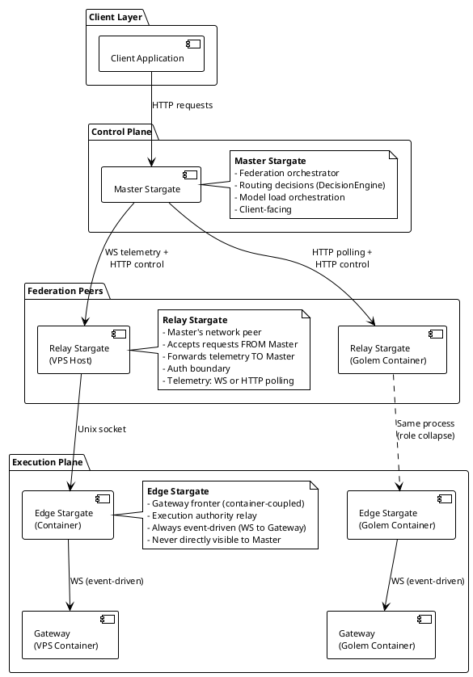
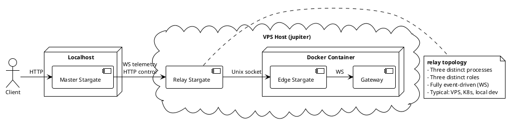
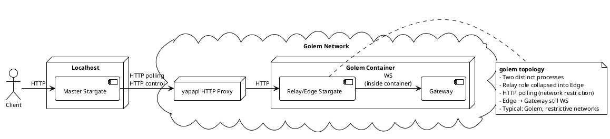
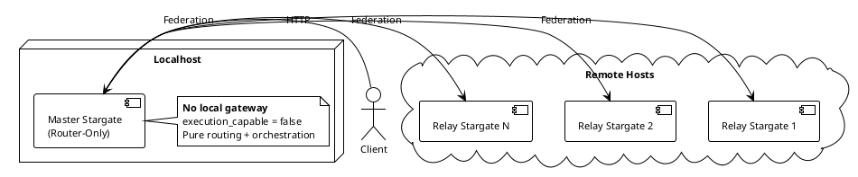
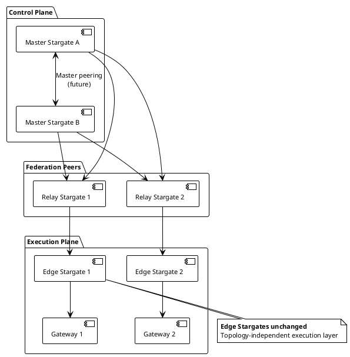

# Federation Architecture: Topologies and Roles

## Overview

The Universal LLM Gateway federation system uses a **topology-based architecture** with fixed roles and flexible connection graphs.

**Key Separations**:
- **Topology** = Connection graph (how many of each role, how they connect)
- **Roles** = Fixed responsibilities (Master, Relay, Edge)
- **Mechanisms** = Fixed transport options (WebSocket, HTTP polling, Unix socket)
- **Deployment** = Platform/environment (Host, container, Golem, K8s)

---

## Supported Topologies

The system supports **two topologies**:

1. **relay topology** - Master connects to relay stargates, which may have edge stargates
2. **golem topology** - Master connects directly to edge stargates (relay role collapses)

---

## relay topology

> A deployment topology where the Master Stargate connects to one or more relay stargates, and edge stargates may exist behind those relays.

**Connection Graph**:
```
Master Stargate (1)
   |
   | (HTTP control + WS telemetry)
   v
Relay Stargate (1..*)
   |
   | (WS / Unix socket)
   v
Edge Stargate (0..1 per relay)
   |
   v
Gateway
```

**Formal Cardinality**:
| Component | Count |
|-----------|-------|
| Master Stargate | 1 |
| Relay Stargates | 1..* |
| Edge Stargates | 0..1 per Relay |

**Key Properties**:
- Relay and Edge are **distinct** (separate processes)
- Fully event-driven telemetry (WebSocket)
- Unix socket or HTTP between Relay and Edge
- Typical deployments: VPS, bare metal, K8s, local development

**Use Cases**:
- Standard VPS deployments
- Kubernetes clusters
- Local development (Docker containers)
- Bare metal servers
- Any environment with normal network access

---

## golem topology

> A deployment topology where the Master Stargate connects **directly** to one or more edge stargates, and no standalone relay stargates exist.

**Connection Graph**:
```
Master Stargate (1)
   |
   | (HTTP control + HTTP polling telemetry)
   v
Edge Stargate (1..*)
   |
   | (WS, internal)
   v
Gateway
```

**Formal Cardinality**:
| Component | Count |
|-----------|-------|
| Master Stargate | 1 |
| Relay Stargates | 0 |
| Edge Stargates | 1..* |

**Key Properties**:
- Relay and Edge roles **collapse** into single process
- HTTP polling telemetry (network restrictions)
- WebSocket internal to container (Edge → Gateway)
- Typical deployments: Golem Network, restrictive network environments

**Use Cases**:
- Golem Network (yapapi HTTP proxy)
- Network-restricted containers
- Environments without outbound WebSocket support
- Air-gapped deployments with polling

---

## Topology Comparison

| Aspect | relay topology | golem topology |
|--------|----------------|----------------|
| **Relay Stargate** | Exists (1..*) | Does not exist (0) |
| **Edge Stargate** | Optional (0..1 per relay) | Required (1..*) |
| **Role Collapse** | No | Yes (Relay/Edge → single process) |
| **Telemetry** | WebSocket (event-driven) | HTTP polling (restrictive networks) |
| **Master → Execution** | Master → Relay → Edge → Gateway | Master → Edge → Gateway |
| **Network Requirements** | Normal (WS, HTTP) | Restricted (HTTP only) |
| **Latency** | Lower (event-driven) | Higher (polling interval) |
| **Complexity** | Higher (more hops) | Lower (fewer hops) |

---

## Role Definitions


<details>
<summary>PlantUML Source Code</summary>



</details>

---

**Roles are invariant across topologies**. The same three roles exist conceptually in both topologies.

| Role | Purpose | Exists In |
|------|---------|-----------|
| **Master Stargate** | Federation orchestrator, routing decisions | Both topologies |
| **relay stargate** | Master's federation peer, auth boundary | relay topology only |
| **edge stargate** | Gateway fronter, execution authority relay | Both topologies |

---

## Visual Topology Examples

### relay topology Example (VPS Deployment)


<details>
<summary>PlantUML Source Code</summary>



</details>

**Characteristics**:
- **Topology**: Relay
- **Processes**: 3 (Master, Relay, Edge+Gateway)
- **Roles**: Master (1), Relay (1), Edge (1)
- **Telemetry**: WebSocket (event-driven)
- **Communication**: Unix socket between Relay and Edge
- **Use Case**: Standard VPS or container deployment

---

### golem topology Example


<details>
<summary>PlantUML Source Code</summary>



</details>

**Characteristics**:
- **Topology**: Golem
- **Processes**: 2 (Master, Edge+Gateway)
- **Roles**: Master (1), Edge (1), Relay (0 - collapsed)
- **Telemetry**: HTTP polling (network restriction)
- **Communication**: Internal WebSocket (Edge → Gateway)
- **Use Case**: Golem Network, network-restricted environments

---

### Router-Only Master (relay topology variant)


<details>
<summary>PlantUML Source Code</summary>



</details>

---

## Configuration Examples

### relay topology Configuration

**Master (relay topology)**:
```yaml
# stargate_config.yaml
federation:
  mode: master
  topology: relay  # Optional identifier
  remotes:
    - stargate_id: jupiter
      url: "https://jupiter:9999"
      disable_websocket: false  # WS telemetry (relay topology)
      api_key: "${FEDERATION_KEY_JUPITER}"
    - stargate_id: saturn
      url: "https://saturn:9999"
      disable_websocket: false
      api_key: "${FEDERATION_KEY_SATURN}"
```

**Remote (relay topology)**:
```yaml
# stargate_config.yaml
federation:
  mode: remote
  topology: relay  # Optional identifier
  master:
    stargate_id: earth
    url: "https://earth:9999"
    api_key: "${FEDERATION_KEY_EARTH}"
  local_gateway:
    socket_path: "/tmp/universal-protocol/gateway.sock"
    gateway_id: "jupiter/gateway"
    public_url: "http://jupiter:9999"
```

### golem topology Configuration

**Master (golem topology)**:
```yaml
# stargate_config.yaml
federation:
  mode: master
  topology: golem  # Optional identifier
  remotes:
    - stargate_id: golem-1
      url: "http://127.0.0.1:8080"  # yapapi proxy
      disable_websocket: true  # HTTP polling (golem topology)
      telemetry_poll_interval_ms: 5000
      api_key: "${GOLEM_FEDERATION_KEY}"
    - stargate_id: golem-2
      url: "http://127.0.0.1:8081"
      disable_websocket: true
      telemetry_poll_interval_ms: 5000
      api_key: "${GOLEM_FEDERATION_KEY}"
```

**Remote (golem topology)**:
```yaml
# stargate_config.yaml
federation:
  mode: remote
  topology: golem  # Optional identifier
  disable_websocket: true  # No outbound WS (golem topology)
  master:
    stargate_id: earth
    url: "http://earth:9999"  # Via yapapi proxy
    api_key: "${FEDERATION_KEY_EARTH}"
  local_gateway:
    socket_path: "/sockets/gateway.sock"  # Container path
    gateway_id: "golem-1/gateway"
    public_url: "http://127.0.0.1:8080"  # yapapi proxy URL
```

---

## Role vs. Transport vs. Topology vs. Deployment

| Concept | Nature | Examples | Configuration |
|---------|--------|----------|---------------|
| **Topology** | Connection graph structure | Relay topology, Golem topology | Derived from disable_websocket pattern |
| **Role** | Responsibility in graph | Master, Relay, Edge | Derived from mode + local_gateway |
| **Transport** | Layer C mechanism | WebSocket, HTTP polling, Unix socket | `disable_websocket` flag |
| **Deployment** | Platform/environment | Host, container, Golem, K8s | Infrastructure choice |

### Anti-Patterns ❌

- "container remote" (deployment as identity)
- "golem remote" (platform as identity)
- "HTTP polling remote" (transport as identity)
- Using `disable_websocket` to identify deployment type

### Correct Patterns ✅

- "relay topology" or "golem topology" (connection graph)
- "relay stargate" (role)
- "telemetry=ws" or "telemetry=http_polling" (transport mechanism)
- "edge-coupled stargate" (role + deployment characteristic)
- "role collapse" (topology characteristic)

---

## Topology Derivation

Topology is **derived** from configuration patterns:

```python
# Relay topology (derived)
mode = "master" ∧ ∃ remote: ¬remote.disable_websocket ⟹ relay_topology

# Golem topology (derived)
mode = "master" ∧ ∀ remote: remote.disable_websocket ⟹ golem_topology

# Mixed topology (not recommended but supported)
mode = "master" ∧ ∃ r1: ¬r1.disable_websocket ∧ ∃ r2: r2.disable_websocket
  ⟹ hybrid_topology (relay + golem)
```

**Note**: Optional `topology` field in config documents intent but is not enforced.

---

## Why Topology Matters

1. **Topology ≠ Deployment ≠ Transport**
   - Topology describes the **connection graph**
   - Deployment describes the **platform** (Docker, K8s, Golem)
   - Transport describes the **mechanism** (WS, HTTP, Unix socket)

2. **Survives Future Schedulers**
   - Kubernetes clusters → relay topology
   - Nomad clusters → relay topology
   - Future Golem-like platforms → golem topology
   - Bare metal → relay topology

3. **Multi-Master Compatible**
   - Future: "multi-master relay topology"
   - Future: "multi-master golem topology"
   - Orthogonal to relay vs. golem distinction

4. **Declarative Documentation**
   - "This system supports two topologies"
   - "Within a topology, roles are invariant"
   - No footnotes, no exceptions

---

## Removed Sections

The following sections have been replaced by topology-focused documentation:

- **Configuration Mapping** → See "Configuration Examples" and "Topology Derivation"
- **Telemetry Transport** → See "Role vs. Transport vs. Topology vs. Deployment"

---

## Multi-Master Readiness

The role model naturally extends to multi-master:


<details>
<summary>PlantUML Source Code</summary>



</details>

**Key Insight**: Edge Stargates remain unchanged in multi-master. Only control plane topology changes.

---

## Logging Examples

### Master Startup (Execution-Capable)
```
[INFO] Master Stargate initialized (execution_capable=true)
[INFO] relay stargates: ['jupiter (telemetry=ws)', 'golem-1 (telemetry=http_polling)']
```

### Remote Startup (VPS - Relay + Edge Separation)
```
[INFO] Relay/Edge Stargate initialized (mode=remote, stargate_id=jupiter, telemetry=ws)
[INFO] edge coupled to gateway: jupiter/gateway
```

### Remote Startup (Golem - Role Collapse)
```
[INFO] Relay/Edge Stargate initialized (mode=remote, stargate_id=golem-1, telemetry=http_polling)
[INFO] edge coupled to gateway: golem-1/gateway
```

### WebSocket Authentication
```
[INFO] ✅ Relay stargate jupiter authenticated (telemetry=ws)
```

### HTTP Polling Start
```
[INFO] Started HTTP polling for relay stargate golem-1 (interval=5000ms)
[INFO] Registered relay stargate golem-1 (telemetry=http_polling)
```

---

## Benefits

1. **Clarity**: Roles are first-class concepts, not derived from transport or platform
2. **Separation of Concerns**: Topology, transport, and deployment are independent axes
3. **Deployment Agnostic**: Works for host, container, Golem, K8s, bare metal, etc.
4. **Multi-Master Ready**: Role model extends naturally to distributed control plane
5. **Observable**: Logs show role context, making debugging easier
6. **Scalable**: Prevents conflation as system grows

---

## References

- Implementation: `services/universal-stargate/systems/federation/`
- Full documentation: `services/universal-stargate/systems/federation/README_AI.md`
- Configuration schema: `common/config/schema.py`
- Summary: `tmp/prompts/uniform-remote-stargate/summaries/role-based-naming-update.md`
