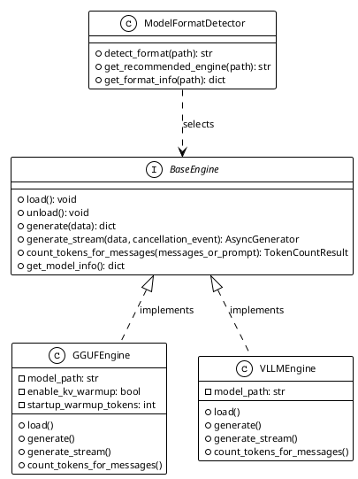
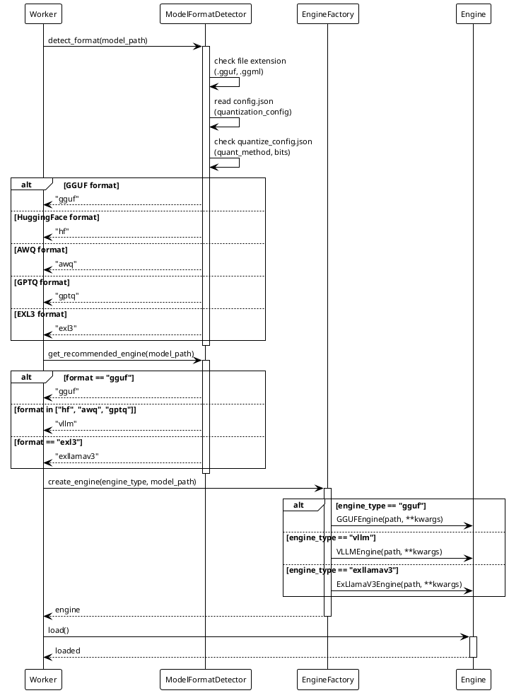

# Inference Djinn

[](https://opensource.org/licenses/MIT)

**Multi-engine LLM inference framework with intelligent model routing and format detection**

Inference Djinn is a flexible, high-performance inference engine that automatically selects and configures the optimal backend for any LLM model format. Part of the Universal LLM Ecosystem.

## Features

- 🔄 **Multi-Engine Support**: GGUF (llama.cpp), vLLM, and ExLlamaV3 backends
- 🎯 **Automatic Format Detection**: Intelligently detects model format and selects optimal engine
- ⚡ **High Performance**: Optimized for modern hardware (RTX 5090/Blackwell, AMD Ryzen)
- 🔧 **Flexible Configuration**: YAML-based configuration with per-model profiles
- 📊 **Token Counting**: Accurate token counting for all model formats
- 🌊 **Streaming Support**: OpenAI-compatible streaming responses
- 💾 **Memory Management**: Smart memory allocation and GPU layer optimization
- 🔍 **Model Inspection**: Extract metadata and capabilities without loading models
- 🎨 **Chat Templates**: Automatic chat template detection and application
- 📈 **Benchmarking**: Built-in performance benchmarking tools

## Architecture

### Engine Abstraction

All engines implement a common interface for consistent behavior:

| Method | Purpose | Input | Output |
|--------|---------|-------|--------|
| `load()` | Load model into memory | None | None (async) |
| `generate()` | Non-streaming inference | Request data | Complete response |
| `generate_stream()` | Streaming inference | Request data + cancellation event | Async generator of chunks |
| `count_tokens_for_messages()` | Token counting | Messages or prompt string | Token count |
| `unload()` | Release resources | None | None (async) |
| `get_model_info()` | Model metadata | None | Info dict |

**Invariant**: ∀ engine: implements(BaseEngine) ⟹ supports(load, generate, generate_stream, count_tokens, unload)

### Supported Engines

| Engine | Backend | Formats | GPU Required | CPU Support | Use Case |
|--------|---------|---------|--------------|-------------|----------|
| GGUFEngine | llama-cpp-python (DEPRECATED) | All GGUF quantizations | No | Yes (full) | LEGACY - use NativeGGUFEngine instead |
| VLLMEngine | vLLM | HF (FP16/BF16), AWQ, GPTQ | Yes | No | High-throughput GPU inference |
| ExLlamaV3Engine | ExLlamaV3 | EXL3, GPTQ | Yes | No | Experimental/Future |

**Status**: ExLlamaV3Engine is currently experimental. GGUF and vLLM engines are production-ready.

### Format Detection

The `ModelFormatDetector` automatically selects the appropriate engine based on model path characteristics:

**Detection Rules**:

| File Pattern | Detected Format | Selected Engine |
|--------------|-----------------|-----------------|
| `*.gguf`, `*.ggml` | GGUF | GGUFEngine |
| `config.json` + `*.safetensors` | HuggingFace | VLLMEngine |
| `quantize_config.json` (bits: 2/3/4/8) | GPTQ | VLLMEngine |
| `config.json` (quant_method: awq) | AWQ | VLLMEngine |
| `*.exl3` or `quant_config.json` (version ≥3) | EXL3 | ExLlamaV3Engine |

**Fallback**: Unknown formats default to `VLLMEngine`.

### RPC Integration

Inference Djinn runs inside Gateway worker processes and receives RPC calls via `universal_protocol`.

**Worker Process Flow**:

```
1. Supervisor spawns worker process (process_ipc)
2. Worker initializes engine based on model format (format detection)
3. Worker listens on Unix socket for RPC calls (universal_protocol)
4. RPC calls invoke engine methods (load, generate, count_tokens, unload)
5. Responses streamed back via socket (streaming or regular)
```

**RPC Method Mapping**:

| RPC Method | Engine Method | Blocking | Response Type |
|------------|---------------|----------|---------------|
| `load_model` | `engine.load()` | Yes (minutes) | Status dict |
| `unload_model` | `engine.unload()` | Yes (seconds) | Status dict |
| `run_inference` | `engine.generate()` | Yes | Complete response dict |
| `start_inference` | `engine.generate_stream()` | Streaming | SSE token frames |
| `count_tokens` | `engine.count_tokens_for_messages()` | No (fast) | Token count |

See `services/_universal-llm-gateway` for worker implementation details.

## Architecture Diagrams


### Engine Abstraction


<details>
<summary>PlantUML Source</summary>



</details>

### Format Detection Flow


<details>
<summary>PlantUML Source</summary>



</details>


## Engine Details

### GGUF Engine (llama.cpp)

**DEPRECATED**: Use NativeGGUFEngine (llama-server) for new deployments.

**Backend**: llama-cpp-python (supports Blackwell-optimized version 9.9.9)

**Supported Formats**:
- All GGUF quantizations (Q4_K_M, Q5_K_M, Q8_0, Q6_K, etc.)
- Legacy GGML format (limited support)

**Legacy Status**: Retained for historical compatibility only. Sequential inference makes it unsuitable for production workloads.

**Key Parameters**:

| Parameter | Description | Source | Default/Notes |
|-----------|-------------|--------|---------------|
| `enable_kv_warmup` | KV cache warmup | Library | True (recommended) |
| `startup_warmup_tokens` | Warmup tokens | Library | 20 (on load) |
| `n_ctx` | Context length | Catalog | 4096 (matches model) |
| `n_gpu_layers` | GPU offload layers | Catalog | -1 (full GPU) |
| `n_threads` | CPU threads | Backend | auto-detected |
| `n_batch` | Batch size | Catalog | 512 |
| `use_mmap` | Memory-map model file | Catalog | False |
| `use_mlock` | Lock model in RAM | Catalog | True |

**CPU/GPU Support**:
- **Pure CPU mode**: `n_gpu_layers=0` (no CUDA required)
- **Full GPU mode**: `n_gpu_layers=-1` (offload all layers)
- **Hybrid mode**: `n_gpu_layers=N` (partial offload, e.g., N=20)

**Streaming**:
- Native streaming via generator pattern
- SSE-compatible output format (OpenAI schema)
- Supports cancellation via `asyncio.Event`

**Implementation**: `engines/gguf/engine/engine.py`

### vLLM Engine

**Backend**: vLLM (optimized for RTX 5090 / Blackwell architecture)

**Supported Formats**:
- HuggingFace (FP16, BF16)
- AWQ quantized (4-bit)
- GPTQ quantized (2/3/4/8-bit)

**Key Parameters**:

| Parameter | Description | Source | Recommended |
|-----------|-------------|--------|-------------|
| `tensor_parallel_size` | GPU parallelism | Catalog | 1 (single GPU) |
| `max_model_len` | Max sequence length | Catalog | model default |
| `gpu_memory_utilization` | VRAM fraction | Catalog | 0.9 |
| `enforce_eager` | Disable Torch compile | Catalog | True (for SM_120) |
| `quantization` | Quantization method | Auto | "awq", "gptq", or None |

**Requirements**:
- CUDA-capable GPU (required)
- Sufficient VRAM for model + KV cache
- Transformers library for tokenization

**Streaming**:
- AsyncIterator-based streaming
- OpenAI-compatible chunk format
- Supports cancellation

**Implementation**: `engines/vllm/engine.py`

**Blackwell Optimization**: vLLM engine is optimized for RTX 5090 (SM_120) when `enforce_eager=True` is set in the model catalog. See `diagnostics/vllm/TORCH_INDUCTOR_TROUBLESHOOTING.md`.

## Supported Model Formats

| Format | Engine | Quantization Support | Streaming | CPU Support |
|--------|--------|---------------------|-----------|-------------|
| GGUF | llama.cpp | All GGUF quants | ✅ | ✅ Full |
| HuggingFace | vLLM | FP16, BF16 | ✅ | ❌ GPU only |
| AWQ | vLLM | 4-bit | ✅ | ❌ GPU only |
| GPTQ | vLLM | 2/3/4/8-bit | ✅ | ❌ GPU only |
| EXL3 | ExLlamaV3 | EXL3, GPTQ | ✅ (Exp) | ❌ GPU only |

## Installation

### Prerequisites

- Python 3.12+
- Git
- CUDA-capable GPU (optional for GGUF, required for vLLM)

### Virtual Environment

**All Universal LLM Ecosystem components use a shared virtual environment:**

```bash
# Create the shared virtual environment (if not already created)
python3.12 -m venv $HOME/.venvs/universal

# Activate
source $HOME/.venvs/universal/bin/activate

# Verify Python version
python --version  # Should be Python 3.12.x or higher
```

**Important**: The shared virtual environment `$HOME/.venvs/universal` is used across all ecosystem components (universal-llm-gateway, universal-stargate, universal_logging, universal-event-bus, etc.). This ensures consistent Python versions and allows ecosystem components to import each other.

### Install Dependencies

```bash
# Install core dependencies
pip install -r requirements.txt

# Optional: Install engine-specific dependencies
# For vLLM support (HuggingFace models)
pip install vllm torch

# For ExLlamaV3 support (GPTQ/EXL3 models)
# pip install exllamav3
```

### Ecosystem Components

This component depends on other Universal LLM Ecosystem packages. Ensure they are accessible in the Python path (they should be in the shared venv or PYTHONPATH):

- `universal_logging` - Structured logging framework
- `universal-event-bus` - Event messaging and coordination
- `universal_transport` - Transport layer for IPC
- `universal_protocol` - Protocol layer for RPC patterns

## Quick Start

### Basic Usage

```python
from inference_djinn.engines import GGUFEngine, VLLMEngine
from inference_djinn.utils.format_detector import ModelFormatDetector

# Automatic engine selection
detector = ModelFormatDetector()
format_type = detector.detect_format("/path/to/model")

if format_type == "gguf":
    engine = GGUFEngine(model_path="/path/to/model.gguf", n_ctx=4096)
elif format_type in ["hf", "awq", "gptq"]:
    engine = VLLMEngine(model_path="/path/to/model")
else:
    raise ValueError(f"Unsupported format: {format_type}")

# Load model
await engine.load()

# Generate completion
messages = [
    {"role": "system", "content": "You are a helpful assistant."},
    {"role": "user", "content": "Hello!"}
]

response = await engine.generate({"messages": messages, "max_tokens": 100})
print(response["choices"][0]["message"]["content"])

# Streaming
async for chunk in engine.generate_stream({"messages": messages, "max_tokens": 100}):
    delta = chunk.get("choices", [{}])[0].get("delta", {})
    if "content" in delta:
        print(delta["content"], end="", flush=True)
```

### GGUF Configuration Generator

Generate optimized GGUF configurations for your hardware:

```bash
# Test GPU layers
python scripts/gguf_model_config_generator.py \
    /path/to/model.gguf \
    --test-gpu \
    --ctx 4096 \
    --output config.yaml

# Test CPU-only profile
python scripts/gguf_model_config_generator.py \
    /path/to/model.gguf \
    --test-cpu \
    --ctx 8192 \
    --output config.yaml

# Push to universal-llm-gateway API
python scripts/gguf_model_config_generator.py \
    /path/to/model.gguf \
    --push \
    --model-key my-model \
    --api-url http://localhost:9998
```

See [scripts/README_GGUF_CONFIG_GENERATOR.md](scripts/README_GGUF_CONFIG_GENERATOR.md) for details.

### Benchmarking

Run performance benchmarks across different configurations:

```bash
cd benchmark
./run_example.sh

# Or manually
python run_benchmark.py \
    --config configs/gpu/llama_chat.yaml \
    --prompt-set reasoning_prompts.json \
    --output results/
```

## Project Structure

```
inference_djinn/
├── engines/                # Backend implementations
│   ├── base.py             # Abstract base engine interface
│   ├── gguf/               # llama.cpp backend (GGUF models)
│   │   ├── engine/
│   │   │   ├── engine.py           # Main GGUF engine
│   │   │   ├── loading.py          # Model loading
│   │   │   ├── token_counting.py   # Token counting
│   │   │   ├── inference/          # Inference implementations
│   │   │   └── formatting/         # Prompt building
│   │   └── inspector.py    # GGUF metadata extraction
│   ├── vllm/               # vLLM backend (HF, AWQ, GPTQ)
│   │   ├── engine.py               # Main vLLM engine
│   │   └── engine/
│   │       ├── loading.py          # Model loading
│   │       ├── quantization.py     # Quantization detection
│   │       ├── inference/          # Inference implementations
│   │       └── formatting/         # Prompt building
│   ├── exl3/               # ExLlamaV3 backend (experimental)
│   └── whisper/            # Whisper ASR engine (not documented here)
├── utils/                  # Shared utilities
│   ├── format_detector.py  # Model format detection
│   ├── streaming_core.py   # Streaming primitives
│   └── types.py            # Type definitions
├── catalog/                # Model catalog and discovery
├── config/                 # Configuration management
├── diagnostics/            # Engine testing and diagnostics
├── benchmark/              # Performance benchmarking
├── scripts/                # Utility scripts
└── examples/               # Usage examples
```

## Configuration

Configuration uses YAML files with support for:
- Model-specific profiles (GPU, CPU, hybrid)
- Sub-profiles for different context lengths
- Chat template override
- Generation parameter defaults
- Hardware optimization hints

Example catalog configuration (hoisted structure):

```yaml
metadata:
  name: "Llama-3.2-3B-Instruct"
  format: "gguf"
  quant: "Q4_K_M"

download:
  huggingface:
    repo: "meta-llama/Llama-3.2-3B-Instruct-GGUF"
    file: "llama-3.2-3b-instruct-q4_k_m.gguf"
  size_bytes: 2147483648

configurations:
  base_loader:
    f16_kv: true
    use_mmap: false
    use_mlock: true
    verbose: false
  
  gpu-batch512:
    base_loader:
      n_batch: 512
    profiles:
      '4096': {n_gpu_layers: 26, ram_mb: 1024, vram_mb: 4096}
      '8192': {n_gpu_layers: 26, ram_mb: 2048, vram_mb: 6144}
  
  cpu-batch512:
    base_loader:
      n_batch: 512
    profiles:
      '4096': {n_gpu_layers: 0, ram_mb: 4096, vram_mb: 0}
```

## Documentation

- [AI Agent Reference](README_AI.md) - AI agent operational reference
- [GGUF Config Generator](scripts/README_GGUF_CONFIG_GENERATOR.md) - Configuration generation guide
- [VLLM Engine](docs/VLLM_ENGINE.md) - vLLM backend documentation
- [Streaming Architecture](docs/STREAMING_EVENT_ARCHITECTURE.md) - Streaming event system
- [Environment Setup](docs/wheelhouse/ENVIRONMENT_SETUP_GUIDE.md) - Development environment guide

## Development

See [CONTRIBUTING.md](CONTRIBUTING.md) for development setup, coding standards, and contribution guidelines.

## Examples

The `examples/` directory contains demonstration scripts:

- **engine_selection_demo.py** - Automatic engine selection based on model format
- **vllm_demo.py** - vLLM engine usage examples
- **cancellation_demo.py** - Request cancellation handling

Run examples:

```bash
python examples/engine_selection_demo.py /path/to/model
```

## Diagnostics

The `diagnostics/` directory contains testing utilities for each engine:

- **gguf/** - GGUF/llama.cpp diagnostics and capacity testing
- **vllm/** - vLLM memory testing
- **exl3/** - ExLlamaV3 inference testing

## Benchmarking

Comprehensive benchmarking framework with:
- Multiple prompt categories (creative, reasoning, technical, standard)
- Configurable test scenarios (different context lengths, batch sizes)
- Statistical analysis and comparison tools
- Hardware utilization tracking

See [benchmark/README.md](benchmark/README.md) for details.

## Ecosystem Integration

Inference Djinn integrates with the Universal LLM Ecosystem:

- **universal-stargate**: Proxy server that uses Inference Djinn for model serving
- **universal-llm-gateway**: Main gateway that orchestrates inference requests via workers
- **universal_logging**: Structured logging for observability
- **universal-event-bus**: Event-driven coordination

## Author

**krunch3r76** ([@krunch3r76](https://github.com/krunch3r76))

- GitHub: [@krunch3r76](https://github.com/krunch3r76)
- Email: biz@u26a4.com

## License

This project is licensed under the MIT License - see the [LICENSE](LICENSE) file for details.
