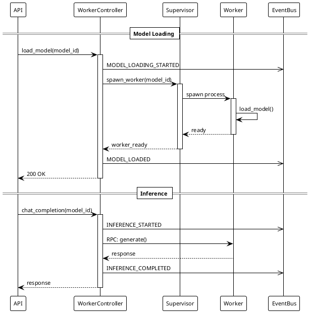
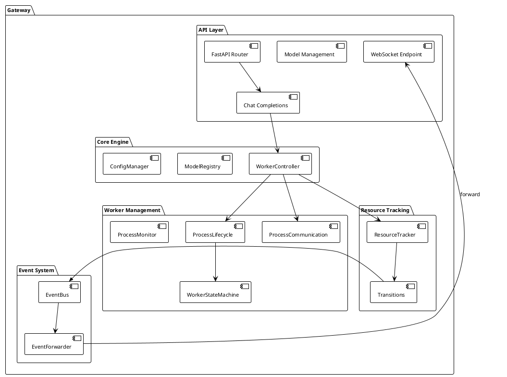

# Universal LLM Gateway

[](https://opensource.org/licenses/MIT)

Universal LLM Gateway is a high-performance, production-ready gateway for serving Large Language Models (LLMs) with advanced features including model hot-swapping, request queuing, streaming support, and comprehensive resource management.

## Features

- **Dynamic Model Loading**: Hot-swap models without service interruption
- **Request Queuing**: Intelligent queue management with priority-based scheduling
- **Streaming Support**: Efficient streaming of chat completions with proper chunking
- **Resource Management**: Advanced resource tracking and monitoring
- **Worker Process Management**: Robust worker lifecycle management with crash recovery
- **Event-Driven Architecture**: Built on `universal_event_bus` for scalable, asynchronous operations
- **Configuration Hot-Reload**: Reload configuration without service restart
- **Multiple Model Formats**: Support for HuggingFace, GGUF, GPTQ, and AWQ models
  - **Note**: llama-cpp-python backend for GGUF is DEPRECATED; use llama-server for new deployments
- **OpenAI-Compatible API**: Drop-in replacement for OpenAI API endpoints
- **Monitoring & Observability**: Integrated metrics, logging, and health monitoring
- **FastAPI-Based**: Modern async HTTP API with WebSocket support

## Architecture

Universal LLM Gateway follows a clean, modular architecture with clear separation of concerns:

- **API Layer**: FastAPI-based OpenAI-compatible HTTP and WebSocket endpoints
- **Core Engine**: Model registry, configuration management, and hot-reload system
- **Worker Management**: Supervisor-based worker process lifecycle management
- **Queue System**: Priority-based request queuing with resource awareness
- **Event System**: Event-driven coordination using `universal_event_bus`
- **Monitoring**: Real-time metrics, health monitoring, and resource tracking

### Pure Passthrough Invariant

**CRITICAL:** Gateway and Workers are **pure passthrough** for generation parameters.

```
∀ client_params: gateway_params = client_params ∖ {routing_metadata}
```

- **Gateway**: NO validation, NO transformation, NO defaults for generation parameters
- **Workers**: Receive parameters unchanged, forward to engines unchanged
- **Stargate**: ONLY layer allowed to modify/inject generation parameters

This ensures parameter modifications are centralized at the proxy layer (Stargate), not scattered across Gateway/Workers.

### Worker Lifecycle

Gateway uses a supervisor pattern (via `process_ipc`) to manage worker processes:

- **State machine**: UNINITIALIZED → LOADING → LOADED ↔ BUSY, plus ERROR/UNLOADING/UNLOADED states
- **Event-driven transitions**: All state changes emit events
- **Supervisor pattern**: Automatic crash recovery and health monitoring
- **RPC communication**: Workers accessed via RPC over Unix domain sockets

#### Worker State Machine

| State | Valid Transitions | Trigger |
|-------|-------------------|---------|
| UNINITIALIZED | → LOADING, → ERROR | Worker lifecycle begins / initialization failure |
| LOADING | → LOADED, → ERROR | Load completes/fails |
| LOADED | → BUSY, → UNLOADING, → ERROR, → LOADING | Inference/unload requested / error / reload |
| BUSY | → LOADED, → UNLOADING, → ERROR | Inference completes / force unload / error |
| ERROR | → UNLOADING, → UNLOADED | Cleanup begins / error cleared |
| UNLOADING | → UNLOADED, → ERROR | Unload completes/fails |
| UNLOADED | → LOADING | Reload requested |

### Event Production

Gateway emits events at state transitions, forwarded to Stargate via WebSocket:

| State Transition | Event Emitted |
|-----------------|---------------|
| → LOADING | MODEL_LOADING_STARTED |
| → LOADED | MODEL_LOADED |
| → BUSY | MODEL_BUSY (via INFERENCE_STARTED) |
| → IDLE | MODEL_IDLE (via INFERENCE_COMPLETED) |
| → ERROR | MODEL_LOAD_FAILED |
| → UNLOADING | MODEL_UNLOADING_STARTED |
| Unload complete | MODEL_UNLOADED |

### WebSocket Telemetry Channel

Gateway exposes `/ws/stargate` WebSocket endpoint for real-time state synchronization with Stargate.

**Message Types:**

| Type | Payload | Purpose |
|------|---------|---------|
| `init` | resources, loaded_models, catalog | Initial state sync on connection |
| `resource_update` | available_vram_mb, available_ram_mb, loaded_models? | Resource state updates (loaded_models optional) |
| `model_loading_started` | model_id | Model load started |
| `model_loaded` | model_id, vram_mb, ram_mb, context_length? | Model available + resource usage |
| `model_load_failed` | model_id, error_message | Model load failed |
| `model_busy` | model_id | Inference started |
| `model_idle` | model_id, last_inference_time | Inference completed + LRU timestamp |
| `model_unloaded` | model_id | Model removed |
| `catalog_update` | reason, models?, catalog? | Catalog refresh notification |
| `gateway_shutdown` | gateway_id, reason, timestamp | Gateway intends to shut down |
| `gateway_draining` | gateway_id, reason, timeout, timestamp | Gateway draining (graceful shutdown) |
| `ping` | — | Keep-alive (Stargate responds with `pong`) |

**Invariant:** Gateway state ONLY updated via event emissions (no manual state updates).

### Worker Lifecycle Flow

The following sequence diagram shows model loading and inference lifecycle:


<details>
<summary>PlantUML Source</summary>



</details>

### Component Architecture


<details>
<summary>PlantUML Source</summary>



</details>

See documentation in `docs/` for detailed architecture information.

## Installation

### Prerequisites

- Python 3.12+
- Git

### Virtual Environment

**All Universal LLM Ecosystem components use a shared virtual environment:**

```bash
# Create the shared virtual environment (if not already created)
python3.12 -m venv $HOME/.venvs/universal

# Activate
source $HOME/.venvs/universal/bin/activate

# Verify Python version
python --version  # Should be Python 3.12.x or higher
```

**Important**: The shared virtual environment `$HOME/.venvs/universal` is used across all ecosystem components (universal-llm-gateway, universal-stargate, universal_logging, universal-event-bus, etc.). This ensures consistent Python versions and allows ecosystem components to import each other.

### Install Dependencies

```bash
pip install -r requirements.txt
```

### Ecosystem Dependencies

Universal LLM Gateway is part of the Universal LLM Ecosystem and depends on:

- `universal_logging` - Structured logging framework
- `universal_event_bus` - Event messaging and coordination
- `universal_transport` - Transport layer abstraction
- `universal_protocol` - Protocol layer for RPC patterns and state channels
- `process_ipc` - Process lifecycle and inter-process communication
- `inference_djinn` - Inference engine integration

These components should be accessible in the shared virtual environment or PYTHONPATH.

## Quick Start

### Run as Service

```bash
# From project root:
./services/_universal-llm-gateway/scripts/start-gateway.sh debug &
```

### Run Directly

```bash
# Using the service manager script (recommended)
./scripts/start-llm-gateway-pid.sh

# Or directly with Python
python -m src.main
```

### Testing Chat Completions

```bash
# Send chat completion request (use http://io:9999 for stargate proxy)
curl -X POST http://io:9999/v1/chat/completions \
  -H "Content-Type: application/json" \
  -d '{
    "model": "your-model-name",
    "messages": [{"role": "user", "content": "Hello!"}],
    "stream": false
  }'
```

## Configuration

Configuration files are located in `config/`:

- `gateway_config.yaml` - Main gateway configuration
- `model_loaders.yaml` - Model loader configurations
- `openai_models.yaml` - OpenAI model definitions
- `logging.yaml` - Logging configuration

Environment variables are loaded from:
- `config/env/gateway.env` (project root) - Base configuration
- `config/env/gateway.env.local` (project root) - Local overrides (not tracked in git)

Note: Environment files are sourced by `start-gateway.sh` before starting the service.

### Transport Configuration

Gateway supports two mutually exclusive transport modes:

**TCP Mode (default):**
```bash
GATEWAY_HOST=0.0.0.0
GATEWAY_PORT=9998
```

**Unix Socket Mode:**
```bash
GATEWAY_UNIX_SOCKET=/tmp/gateway.sock
```

Unix socket mode provides enhanced security (no network exposure), lower latency, and Docker network isolation support.

See [Unix Socket Documentation](../../docs/unix-socket-quickstart.md) for detailed setup.

### Model Configuration Examples

See `docs/examples/` for model configuration examples:
- `hf-model-example.yaml` - HuggingFace models
- `gguf-model-example.yaml` - GGUF models (DEPRECATED: llama-cpp-python)
- `gptq-model-example.yaml` - GPTQ models
- `awq-model-example.yaml` - AWQ models

## Development

### Setup Development Environment

```bash
# Activate shared virtual environment
source $HOME/.venvs/universal/bin/activate

# Install dependencies
pip install -r requirements.txt
```

### Running the Gateway

```bash
# From project root:
./services/_universal-llm-gateway/scripts/start-gateway.sh debug &
```

### Logs

- **Gateway logs**: `${DATA_DIR}/tmp/logs/universal-llm-gateway/gateway.log` (DATA_DIR defaults to `/tmp`)
- **Client logs**: `${DATA_DIR}/logs/universal-stargate/stargate.log` (for debugging client interactions)

## Ecosystem

Universal LLM Gateway is part of the Universal LLM Ecosystem:

- **universal-llm-gateway** - Core gateway service (this project)
- **universal-stargate** - Middleware proxy with intelligent routing
- **universal_logging** - Logging framework
- **universal_transport** - Transport layer
- **universal_protocol** - Protocol layer
- **universal_event_bus** - Event messaging
- **inference_djinn** - Inference engine
- **process_ipc** - Process communication

## Contributing

Contributions are welcome! Please see [CONTRIBUTING.md](CONTRIBUTING.md) for:
- Development environment setup
- Required dependencies and IDE extensions
- Code style guidelines (ruff + BasedPyright)
- Development workflow

**Note**: This project uses **BasedPyright** for type checking (Pylance is superseded by BasedPyright).

## License

This project is licensed under the MIT License - see the [LICENSE](LICENSE) file for details.

## Author

**krunch3r76** ([@krunch3r76](https://github.com/krunch3r76))

- GitHub: [@krunch3r76](https://github.com/krunch3r76)
- Email: biz@u26a4.com

## Acknowledgments

Built as part of the Universal LLM Ecosystem for scalable, production-ready LLM infrastructure.

