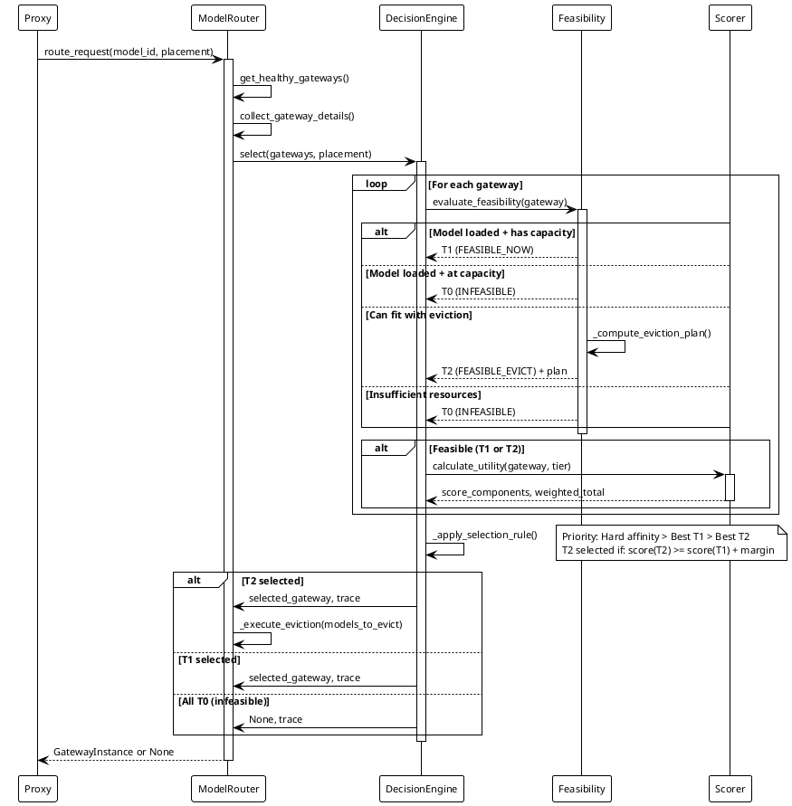
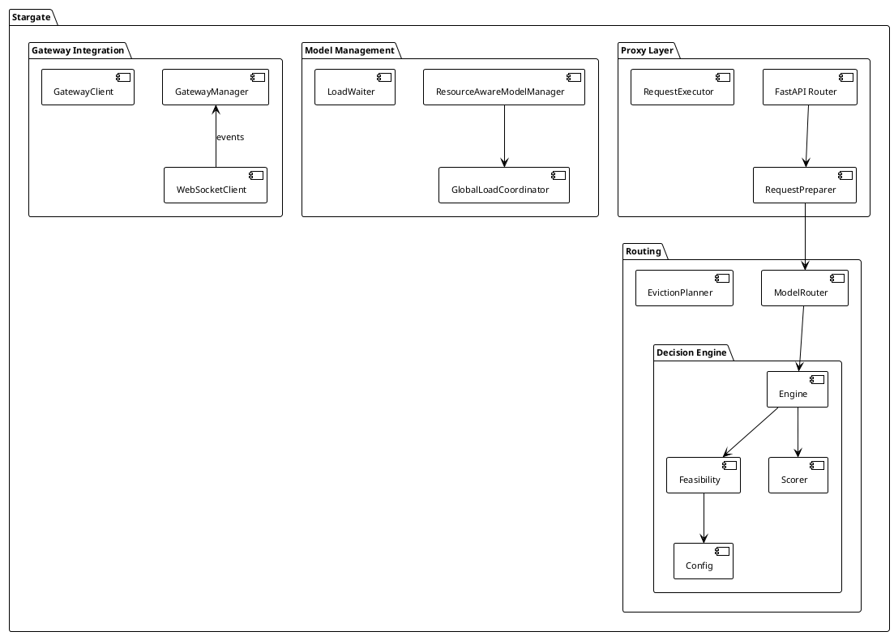

# Universal Stargate

[](https://opensource.org/licenses/MIT)

Universal Stargate is a high-performance middleware proxy for LLM (Large Language Model) gateways, providing intelligent routing, request transformation, and resource management for distributed LLM infrastructure.

## Features

- **Intelligent Request Routing**: Resource-aware routing with queue management and load balancing
- **Chat Template Transformations**: Preserve personality and formatting across different LLM backends
- **Token Management**: Efficient token counting and context management
- **Event-Driven Architecture**: Built on `universal_event_bus` for scalable, asynchronous operations
- **Monitoring & Observability**: Integrated metrics, logging, and health monitoring
- **GUI Dashboard**: Real-time monitoring and control interface
- **FastAPI-Based**: Modern async HTTP API with SSE streaming support

## External Domain Integration

Universal-stargate supports external domain-specific pipelines.

### Features

- **Multiple pipeline sources**: Load from multiple directories
- **Custom handlers**: Register domain-specific step handlers
- **Enhanced conditions**: Reference previous step outputs in conditions

### Quick Setup

1. Configure search paths in `stargate_config.yaml`
2. Create handler package with entry point
3. Define pipelines in your project directory

See [External Domain Integration Guide](../../docs/external-domain-integration.md) for details.

## Pipeline Execution Summaries

Pipeline execution summaries provide detailed post-execution analysis and debugging capabilities for pipeline workflows.

### Enabling Summaries

Enable execution summaries by setting `save_execution_summary: true` in your pipeline configuration:

```yaml
options:
  save_execution_summary: true
  summary_format: "markdown"  # Optional: "markdown" (default), "yaml", "json", or "all"
```

### Summary Content

Execution summaries capture complete pipeline execution details:

- **Complete execution metadata** - Pipeline ID, version, execution time, timestamp
- **Captured prompts** - System and user messages sent to models for each step
- **All step outputs** - Raw responses, parsed data, extracted text
- **Token usage breakdown** - Per-step prompt tokens, completion tokens, and totals for cost analysis
- **Step configuration** - Model refs, prompt refs, temperature, dependencies
- **Full request/response bodies** - Complete audit trail

### Format Options

**Markdown (default)** - Human-readable with prominent prompt display:
```yaml
summary_format: "markdown"
```

**YAML** - Human + machine readable, structured:
```yaml
summary_format: "yaml"
```

**JSON** - Machine readable, compact:
```yaml
summary_format: "json"
```

**All formats**:
```yaml
summary_format: "all"  # Writes .md, .yaml, and .json files
```

### Example Markdown Output

```markdown
### 1. Step: `generate`

- **Type**: generate
- **Model**: hermes-70b-16384
- **Latency**: 2240ms

**Token Usage:**
- Prompt Tokens: 156
- Completion Tokens: 294
- Total Tokens: 450

**Configuration:**
- Model Ref: `hermes-70b`
- Prompt Ref: `translate-prompt`
- Temperature: 0.3

**Prompts Sent to Model:**

*System Prompt:*
```
You are a professional translator. Translate accurately while preserving tone.
```

*User Prompt:*
```
Translate the following text to French:
"Hello, how are you today?"
```

**Raw Output:**
```
Bonjour, comment allez-vous aujourd'hui ?
```
```

### Summary File Organization

Summaries are organized by pipeline ID in subdirectories:

```
{LOG_DIR}/pipeline_summaries/
├── en-en-csc/
│   └── 20251229_120000_abc12345.md      # Default: markdown only
├── translation-pipeline/
│   ├── 20251229_120100_def67890.md      # Markdown (always if enabled)
│   ├── 20251229_120100_def67890.yaml    # Optional: if summary_format includes yaml
│   └── 20251229_120100_def67890.json    # Optional: if summary_format includes json
└── custom-workflow/
    ├── 20251229_120200_ghi12345.md
    ├── 20251229_120200_ghi12345.yaml
    └── 20251229_120200_ghi12345.json     # If summary_format: "all"
```

**File naming**: `YYYYMMDD_HHMMSS_{execution_id}.{ext}`

### Summary Lifecycle

Summaries use a retention policy to prevent disk space issues:

- **Retention**: Configurable via `MAX_SUMMARIES_PER_PIPELINE` (default: 1)
- **Per-pipeline**: Each pipeline ID has its own retention limit
- **Automatic cleanup**: Old summaries deleted after successful writes
- **Timestamped files**: Most recent files kept based on modification time

### Debugging with Summaries

**Prompt Debugging**:
- See exact system and user prompts sent to models
- No template reconstruction needed
- Compare prompts across different executions

**Performance Analysis**:
- Per-step latency tracking
- Token usage per step
- Identify bottlenecks in multi-step pipelines

**Output Verification**:
- Raw model outputs before parsing
- Parsed structured data
- Extracted text for next steps

**Configuration Audit**:
- Model selections per step
- Temperature and parameter settings
- Step dependencies and execution order

### Location

Default location: `{LOG_DIR}/pipeline_summaries/`

- `LOG_DIR` environment variable (if set)
- Otherwise: `logs/pipeline_summaries/` (relative to working directory)

For Stargate: typically `/tmp/logs/universal-stargate/pipeline_summaries/`

## Architecture

Universal Stargate is a high-performance middleware proxy for LLM (Large Language Model) gateways, providing intelligent routing, request transformation, and resource management for distributed LLM infrastructure.

### Parameter Modification Responsibility

**CRITICAL:** Stargate is the **ONLY** layer responsible for modifying generation parameters.

```
Gateway/Workers: ∀ params: output_params = input_params ∖ {routing_metadata}
Stargate: ONLY layer allowed to inject/modify generation parameters
```

- **Stargate**: Profiles, transformations, parameter injection/modification
- **Gateway**: Pure passthrough (no validation, no defaults, no modification)
- **Workers**: Pure passthrough (forward parameters unchanged to engines)

This ensures parameter logic is centralized at the orchestration layer, not scattered across the stack.

- **proxy**: HTTP API layer, request/response handling
- **pipeline**: Multi-model LLM workflow orchestration  
- **audio**: Audio processing (VAD, Whisper, profiles)
- **routing**: Gateway selection and routing decisions
- **transformations**: Message/format transformations (messages ↔ prompt)
- **profiles**: Generation parameter management (temperature, engine conversion)

**For detailed directory structure and key files, see [README_AI.md](README_AI.md#directory_structure).**

### Chat Completion Request Flow

A typical chat completion request flows through multiple systems:

```
Client → Stargate:9999/v1/chat/completions
  ↓
[1] Proxy System (systems/proxy/)
  │ - Parse and validate request
  │ - Extract model_id, messages, parameters
  ↓
[2] Profiles System (systems/profiles/)
  │ - Resolve profile (global → model → request)
  │ - Apply generation parameters (temperature, top_p, etc.)
  │ - Inject system prompt (if defined in profile)
  │ - Convert parameters for target engine (llama-cpp ↔ vLLM)
  ↓
[3] Transformations System (systems/transformations/)
  │ - Apply message filters (remove system, truncate, etc.)
  │ - Transform format if needed (messages → prompt)
  │ - Apply model-specific prompting (e.g., CursorCore tokens)
  ↓
[4] Routing System (systems/routing/)
  │ - Evaluate gateway feasibility (T0/T1/T2)
  │ - Score gateways (affinity, warm, slack, contention)
  │ - Select optimal gateway
  │ - Execute evictions if needed (T2)
  ↓
[5] Gateway:9998/v1/chat/completions
  │ - Forward request to selected gateway
  │ - Stream response back to client
  ↓
Response → Client
```

**System Responsibilities:**

- **Proxy**: Request handling, orchestration
- **Profiles**: Generation parameters (temperature, top_p, engine conversion)
- **Transformations**: Format conversion (messages ↔ prompt, filtering)
- **Routing**: Gateway selection (feasibility, scoring, eviction)

**Configuration:**

- `config/profiles.yaml` - Profile definitions and parameters
- `config/model_profiles.yaml` - Model → profile basename mappings
- `config/model_transformations.yaml` - Model → transformation mappings
- `config/stargate_config.yaml` - Routing weights and capacity limits

**Note:** This flow describes chat completion requests. Pipeline requests follow a different path through `systems/pipeline/` which orchestrates multi-step workflows.

### High-Level Architecture

- **Proxy Layer**: FastAPI-based HTTP proxy with request/response handling
- **Core Processing**: Request preparation, execution, and transformation pipeline
- **Routing**: Resource-aware gateway selection with T0/T1/T2 feasibility tiers
- **Scheduling**: Queue management with event-driven wakeups
- **Monitoring**: Metrics collection and event logging
- **GUI**: Real-time dashboard for system monitoring

### Request Routing

Stargate routes client requests to optimal gateways using a decision engine with three feasibility tiers:

#### Feasibility Tiers

| Tier | Meaning | Conditions | Action |
|------|---------|------------|--------|
| T0 | Infeasible | Unhealthy, model not in catalog, insufficient resources, **at capacity** | Skip or queue |
| T1 | Feasible now | Model loaded + has capacity, OR free resources sufficient | Route immediately |
| T2 | Feasible with eviction | Can fit after evicting idle models | Evict, then route |

**Capacity-Aware Routing:** T0 classification includes capacity checks to prevent 503 errors when gateways have models loaded but no available request slots.

- **ALL models**: Check per-model capacity first (GGUF workers serialize per-model; `max_per_model = 1`)
- **Sticky models (`sticky=true`)**: ALSO check per-gateway capacity (`active_requests < max_concurrent_per_gateway`)
- **Non-sticky models (`sticky=false`)**: Only per-model check needed (can route to any gateway)

Both checks must pass for T1 classification when model is already loaded.

#### Decision Engine Process

1. **Collect gateways** from telemetry cache (WebSocket-driven)
2. **Evaluate feasibility** for each gateway (T0/T1/T2 classification)
3. **Score feasible gateways** using utility function:
   ```
   score = affinity_bonus + warm_bonus + slack_score 
           - contention_penalty - staleness_penalty 
           - eviction_penalty + stability_bonus
   ```
4. **Select best gateway:**
   - Hard affinity → enforce that gateway
   - Else: Best T1, OR best T2 if `score(T2) >= score(T1) + eviction_margin`
5. **Return selection** with trace for observability

#### Scoring Components

| Component | Purpose | Source |
|-----------|---------|--------|
| Affinity | User-specified gateway preference | Config: `routing.scoring.affinity_rules` |
| Warm | Model already loaded (avoids load latency) | 100.0 bonus if loaded |
| Slack | VRAM headroom after placement | Calculated from free resources |
| Contention | Active request count | Gateway telemetry |
| Staleness | Telemetry age penalty | Timestamp delta |
| Stability | Hysteresis bonus | Small bonus for current best |
| Eviction | Cost of evicting models | Base + per-model penalty |

See `systems/routing/selection/decision/scorer.py` for weights and calculation.

#### Queue Systems

Stargate uses **three queue/retry systems** that serve different purposes:

1. **NonStickyRequestQueue** (Pre-routing throttling):
   - Used for non-sticky models before routing
   - Prevents worker overload (GGUF limit: 1 concurrent per model per gateway)
   - Per-Stargate instance, uses local `asyncio.Future` for wake-up
   - Gateway-aware: scales with connected gateway count

2. **Sticky Model Retry** (Post-503 event-driven retry):
   - Used when executor returns 503 for sticky model at capacity
   - **Event-driven wake-up**:
     - Edge mode: `model.execution.completed` via `ExecutionCompletionWaiter`
     - Master mode: `GATEWAY_RESOURCE_UPDATE` via `TelemetryFreshnessWaiter`
   - **Monitors**:
     - Connectivity loss: `GATEWAY_STATE_CHANGED[connectivity="unreachable"]`
     - Heartbeat expiry (Master mode): `FederatedGateway.is_unreachable` (>60s)
     - Client disconnect: `request.is_disconnected()`
   - **Termination**: Events drive wake-up; safety net timeout (30 min, defensive)
   - **Contention**: Multiple waiters compete on event; losers wait for next event (no retry limit)
   - **Implementation**: `systems/proxy/stargate/requests/sticky_wait/` package

3. **Main Queue System** (Post-routing global queue):
   - Used when all gateways return T0 (infeasible)
   - Event-driven wake-up via `model.execution.completed` signal
   - Global across Stargate instances
   - Works for both sticky and non-sticky models
   - Timeout: 300s (configurable)

**Config**: `request_queue.max_size: 1000` in `stargate_config.yaml`

#### Slot Reservation Retry

When a gateway is selected from the queue, slot reservation may fail due to race conditions (another request took the slot between queue selection and reservation). The system handles this gracefully:

1. **Automatic Retry**: Up to 5 retries with exponential backoff (0.1s, 0.2s, 0.4s, 0.8s)
2. **Re-queue on Failure**: Each retry re-enters the queue system to get a fresh gateway
3. **503 Only After Exhaustion**: Only returns 503 if all retries are exhausted

This prevents unnecessary 503 errors under high contention while maintaining fairness.

**Implementation**: `systems/proxy/core/nonstreaming/executor.py::_execute_normal_mode()`

#### Sticky Routing

When `model_routing.default_sticky: true` (default):

- Model loaded on at most **ONE** gateway at a time
- Coordinator enforces via sequential coordination (`GlobalModelLoadCoordinator(Sequential)`), not locks
- Prevents resource waste and conflicts
- Override per-model: `model_routing.sticky_overrides`

### Key Invariants (FOL)

```
∀ decision:
  (∃ gateway: tier = T1) ⟹ selected ∈ {gateways | tier = T1}
  (∀ gateway: tier ≠ T1 ∧ ∃ gateway: tier = T2) ⟹ selected ∈ {gateways | tier = T2}
  (∀ gateway: tier = T0) ⟹ queued

∀ model_id where sticky: |{gw | loaded(model_id, gw)}| ≤ 1

∀ gateway, placement:
  (is_loaded(gateway, model) ∧ has_model_capacity(gateway, model) ∧ (sticky ⟹ has_gateway_capacity(gateway))) ⟹ tier = T1
  (is_loaded(gateway, model) ∧ (¬has_model_capacity(gateway, model) ∨ (sticky ∧ ¬has_gateway_capacity(gateway)))) ⟹ tier = T0
```

### Event Consumption

**Important:** Stargate has two "event" layers:

- **WebSocket message types** (`type=...`) from Gateway → update the WebSocket state cache (single source of truth for gateway state)
- **EventBus signals** (`signal=...`) inside Stargate → wake consumers / provide observability

#### WebSocket Telemetry Messages (Gateway → Stargate)

These messages are dispatched by `gateway_websocket/handler/` based on the on-wire `type` string (lower snake-case).

| `type` | Handler | State Update |
|--------|---------|--------------|
| `init` | WebSocket state | Initialize cached gateway state snapshot |
| `resource_update` | `ResourceUpdateHandler` | Update cached resources; optionally refresh `loaded_models` snapshot |
| `model_loading_started` | `ModelLoadingStartedHandler` | Add to cached `loading_models` |
| `model_loaded` | `ModelLoadedHandler` | Add to cached `loaded_models`; clear `loading_models` |
| `model_load_failed` | `ModelLoadFailedHandler` | Clear `loading_models` |
| `model_unloaded` | `ModelUnloadedHandler` | Remove from cached `loaded_models`; cleanup per-model caches |
| `model_busy` | `ModelBusyHandler` | Add to cached `busy_models` |
| `model_idle` | `ModelIdleHandler` | Remove from cached `busy_models`; update `last_inference_time` |
| `catalog_update` | `CatalogUpdateHandler` | Refresh cached catalog/models snapshot |
| `gateway_shutdown` | `GatewayShutdownHandler` | Log intent; connection closes shortly after |
| `gateway_draining` | `GatewayDrainingHandler` | Log draining; routing avoids new work |
| `ping` | `PingHandler` | I/O: respond with `pong` |

#### EventBus Signals (Stargate internal)

| Signal | Consumer | Purpose |
|--------|----------|---------|
| GATEWAY_STATE_CHANGED | Scheduling consumers | Gateway connectivity/health transitions (event-driven, no polling) |
| MODEL_EXECUTION_COMPLETED | QueueManager | Wake queue processors (emitted on MODEL_IDLE / MODEL_UNLOADED) |

**Invariant:** Gateway state ONLY updated via WebSocket events (event-driven, no polling).

**Event Signal Reference:** For complete event signal specifications, see `services/universal-stargate/src/scheduling/EVENTS.md`.

#### Event Subscription Anti-Pattern

**Problem:** Subscribing to events using string literals instead of imported constants.

```python
# ❌ WRONG - String literal will never match
event_bus.subscribe("MODEL_UNLOADED", handler)

# ✅ CORRECT - Import and use the constant
from src.scheduling.events import MODEL_EXECUTION_COMPLETED
event_bus.subscribe(MODEL_EXECUTION_COMPLETED, handler)
```

**Why it fails:** Event signals use dot-notation (e.g., `"model.execution.completed"`), not the constant name. String literals won't match the actual signal value.

**Rule:** Always import event constants from `src/scheduling/events.py`. Never use hardcoded strings for event subscriptions.

### Routing Decision Flow

The following sequence diagram shows how the decision engine selects a gateway:


<details>
<summary>PlantUML Source</summary>



</details>

### Component Architecture


<details>
<summary>PlantUML Source</summary>



</details>

See [proxy/ARCHITECTURE.md](proxy/ARCHITECTURE.md) for detailed architecture documentation.

## Installation

### Prerequisites

- Python 3.12+
- Git

### Virtual Environment

**All Universal LLM Ecosystem components use a shared virtual environment:**

```bash
# Create the shared virtual environment (if not already created)
python3.12 -m venv $HOME/.venvs/universal

# Activate
source $HOME/.venvs/universal/bin/activate

# Verify Python version
python --version  # Should be Python 3.12.x or higher
```

**Important**: The shared virtual environment `$HOME/.venvs/universal` is used across all ecosystem components (universal-llm-gateway, universal-stargate, universal_logging, universal-event-bus, etc.). This ensures consistent Python versions and allows ecosystem components to import each other.

### Install Dependencies

```bash
pip install -r requirements.txt
```

### Ecosystem Dependencies

Universal Stargate is part of the Universal LLM Ecosystem and depends on:

- `universal_logging` - Structured logging framework
- `universal-event-bus` - Event messaging and coordination
- `universal_transport` - Transport layer abstraction
- `universal_protocol` - Protocol layer for RPC patterns

These components should be accessible in the shared virtual environment or PYTHONPATH.

## Quick Start

### Run as Service

```bash
# From project root:
./services/universal-stargate/scripts/start-stargate.sh debug &
```

### Run Directly

```bash
# Using the service manager script (recommended)
scripts/start-stargate.sh default

# Or directly with Python
python start_proxy.py
```

### Run with GUI

```bash
python tools/start_stargate_gui.py
```

## Configuration

Configuration files are located in `config/`:

- `stargate_config.yaml` - Main configuration
- `model_profiles.yaml` - Model profiles and specialties
- `gateways.yaml` - Gateway definitions
- `system_messages.yaml` - System message templates

Environment-specific overrides:
- `stargate.env` - Base configuration
- `stargate-debug.env` - Debug overrides
- `stargate-release.env` - Release overrides

### Transport Configuration

Stargate supports two mutually exclusive transport modes:

**Stargate Server - TCP Mode (default):**
```bash
STARGATE_HOST=0.0.0.0
STARGATE_PORT=9999
```

**Stargate Server - Unix Socket Mode:**
```bash
STARGATE_UNIX_SOCKET=/tmp/stargate.sock
```

**Gateway Client - TCP Mode:**
```yaml
# config/gateways.yaml
gateways:
  - name: remote
    url: http://remote-host:9998
```

**Gateway Client - Unix Socket Mode:**
```yaml
# config/gateways.yaml
gateways:
  - name: localhost
    socket_path: /tmp/gateway.sock
```

Unix socket mode provides enhanced security (no network exposure), lower latency, and Docker network isolation support (`network_mode: "none"`).

All communication layers support Unix sockets:
- HTTP requests (client → Stargate, Stargate → Gateway)
- WebSocket control plane (Stargate → Gateway telemetry)
- WebSocket audio proxy (client → Stargate → Gateway audio streaming)

See [Unix Socket Documentation](../../docs/unix-socket-quickstart.md) for detailed setup.

## Development

### Setup Development Environment

```bash
# Create virtual environment
python -m venv ~/.venvs/universal
source ~/.venvs/universal/bin/activate

# Install dependencies
pip install -r requirements.txt
pip install -r scripts/requirements.txt  # For development scripts
```

### Running Tests

```bash
pytest tests/
```

## Ecosystem

Universal Stargate is part of the Universal LLM Ecosystem:

- **universal-llm-gateway** - Core gateway service
- **universal-stargate** - Middleware proxy (this project)
- **universal_logging** - Logging framework
- **universal_transport** - Transport layer
- **universal_protocol** - Protocol layer
- **universal_event_bus** - Event messaging
- **inference_djinn** - Inference engine
- **process_ipc** - Process communication

## Contributing

Contributions are welcome! Please see [CONTRIBUTING.md](CONTRIBUTING.md) for:
- Development environment setup
- Required dependencies and IDE extensions
- Code style guidelines (ruff + BasedPyright)
- Development workflow

**Note**: This project uses **BasedPyright** for type checking (Pylance is superseded by BasedPyright).

## License

This project is licensed under the MIT License - see the [LICENSE](LICENSE) file for details.

## Author

**krunch3r76** ([@krunch3r76](https://github.com/krunch3r76))

- GitHub: [@krunch3r76](https://github.com/krunch3r76)
- Email: biz@u26a4.com

## Acknowledgments

Built as part of the Universal LLM Ecosystem for scalable, production-ready LLM infrastructure.

