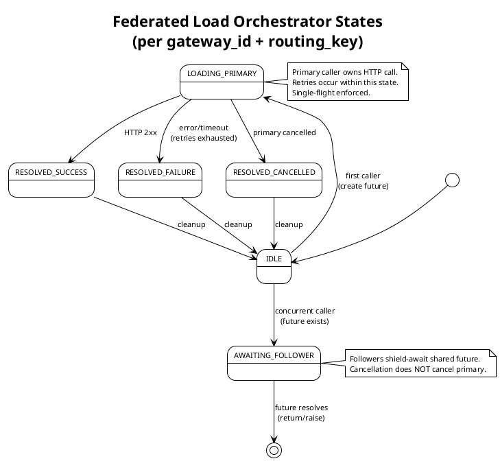

# Federation System

Distributed inference routing across network-isolated Gateways via Remote Stargate proxies.

## Overview

The Federation system enables a Master Stargate to coordinate inference requests across multiple Remote Stargates, each with their own isolated Gateway. This allows horizontal scaling across network boundaries while maintaining centralized routing decisions.

### Key Concepts

- **Master Stargate**: Receives all client requests, makes routing decisions, coordinates model loading
- **Remote Stargate**: Isolated compute node that executes commands from Master
- **Telemetry**: WebSocket-based state updates (Remote → Master)
- **Operations**: HTTP-based commands (Master → Remote)

### Connection Pattern

```
Remote Stargate ─WebSocket─> Master Stargate  (telemetry)
Remote Stargate <──HTTP────── Master Stargate  (requests)
```

## Architecture

### Request Flow

```
Client → Master:9999
         ↓
   DecisionEngine (select Remote Stargate)
         ↓
   Remote:9999 → Gateway (isolated)
```

**Note**: All Gateway access goes through Remote Stargates, even for local deployments.

### Model Orchestration

Master explicitly loads models on Remote before forwarding operations:

1. **Model Loading**: Master → POST Remote `/api/v1/federation/models/load`
2. **Token Counting**: Master → POST Remote `/api/v1/federation/tokens/count`
3. **Inference**: Master → POST Remote `/api/v1/federation/inference`

**Key Principle**: Remote endpoints are pure proxies. All orchestration decisions happen on Master.

## Load Orchestrator State Machine

The `FederatedLoadOrchestrator` coordinates model loading on Remote Stargates using a single-flight pattern to prevent duplicate loads for concurrent requests.

### State Diagram


<details>
<summary>PlantUML Source</summary>



</details>

### States

| State | Description |
|-------|-------------|
| **IDLE** | No in-flight load future exists for this load_key |
| **LOADING_PRIMARY** | Primary caller owns HTTP `/api/v1/federation/models/load` call (including retries) |
| **AWAITING_FOLLOWER** | Follower awaits the shared future (shielded from cancellation) |
| **RESOLVED** | Shared future completed (success, failure, or cancelled); cleanup in progress |

### Single-Flight Coordination

**Problem**: Multiple concurrent requests for the same cold model would trigger multiple load HTTP calls.

**Solution**: Single-flight coordination via shared `asyncio.Future`:
- First caller becomes **primary** and owns the HTTP call
- Concurrent callers become **followers** and await the same future
- Followers use `asyncio.shield()` to prevent their cancellation from affecting the primary
- Load key: `(gateway_id, routing_key)` - tuple prevents collision

**Guarantees**:
- At most one HTTP load call per (gateway, model) at any time
- Followers never hang (future always resolved)
- Follower cancellation never affects primary

### Retry Logic

While in `LOADING_PRIMARY`, the orchestrator may retry based on `OrchestrationConfig`:

- **Retry conditions**: 5xx errors, HTTP phase timeouts, connection errors
- **No retry**: 4xx errors (including 408/409/429), wall-clock timeout, `CancelledError`
- **Backoff**: Exponential with jitter (configurable)

### Timeout Layering

- **Orchestrator timeout (120s)**: Wall-clock authority - hard limit on total operation time
- **httpx timeout**: Phase safety (connect=10s, read=120s, write=10s, pool=10s)

Orchestrator timeout fires first if wall-clock exceeded, regardless of httpx phase.

## Configuration

Configuration is in `config/stargate_config.yaml` under `federation:` section.

### Master Mode Example

```yaml
federation:
  mode: "master"
  stargate_id: "earth"
  
  remotes:
    - stargate_id: "jupiter"
      url: "https://jupiter:9999"
      api_key: "${FEDERATION_KEY_JUPITER}"
  
  orchestration:
    load_timeout: 120
    coalesce_wait_timeout: 150
    load_retry_count: 2
    load_retry_delay: 1.0
    load_retry_backoff: 1.5
```

### Remote Mode Example

```yaml
federation:
  mode: "remote"
  stargate_id: "jupiter"
  
  master:
    stargate_id: "earth"
    url: "https://earth:9999"
    api_key: "${FEDERATION_KEY_EARTH}"
  
  local_gateway:
    socket_path: "/tmp/universal-protocol/gateway.sock"
    gateway_id: "jupiter/local"
```

## Observability

### Metrics Endpoint

```bash
# Auth required (either method)
curl -H "Authorization: Bearer $STARGATE_API_KEY" \
  http://localhost:9999/api/v1/federation/orchestration/metrics

curl -H "X-API-Key: $STARGATE_API_KEY" \
  http://localhost:9999/api/v1/federation/orchestration/metrics
```

### Key Metrics

- `load_operation_success_rate_percent`: Success rate for load operations (target: >95%)
- `coalesce_rate_percent`: Percentage of requests that coalesced (typical: 5-30%)
- `avg_load_latency_ms`: Average load latency (target: <5000ms for cold loads)
- `p99_load_latency_ms`: 99th percentile load latency (target: <15000ms)
- `retry_attempts_total`: Total retry attempts (low growth expected)
- `retries_exhausted_total`: Retries exhausted (should be near zero)

See [RUNBOOK.md](docs/RUNBOOK.md) for detailed metrics interpretation and diagnostics.

## API Endpoints

All federation endpoints require authentication via `X-Federation-Source` + `X-Federation-Key` headers.

| Endpoint | Method | Mode | Purpose |
|----------|--------|------|---------|
| `/api/v1/federation/models/load` | POST | Remote | Model load orchestration (called by Master) |
| `/api/v1/federation/tokens/count` | POST | Remote | Token counting proxy to Gateway |
| `/api/v1/federation/inference` | POST | Remote | Inference request proxy to Gateway |
| `/api/v1/federation/inference/{id}` | DELETE | Remote | Cancel inference request |
| `/ws/federation` | WebSocket | Master | WebSocket endpoint for Remote connections |

## Development

### Key Files

- `orchestration/load_orchestrator.py`: Single-flight load coordination with retry logic
- `orchestration/config.py`: OrchestrationConfig (frozen, runtime validation)
- `orchestration/metrics.py`: OrchestrationMetrics (Prometheus-ready)
- `manager/federated_gateway_manager.py`: Event-driven state management
- `api/models.py`: Model load command endpoint (Remote mode)
- `routing/forward.py`: HTTP request forwarding

### Testing

See project plan: `tmp/prompts/federation-orchestration-hybrid/README.md`

## Documentation

- **README_AI.md**: AI agent navigation guide (text-based, FOL invariants)
- **docs/RUNBOOK.md**: Operational runbook (read-only diagnostics)
- **Project Plan**: `tmp/prompts/federation-orchestration-hybrid/`

## Status

**Federation Core**: ✅ Complete (Phases 1-6)  
**Federation Orchestration**: ✅ Complete (Phases 1-4.4)

Next: Integration testing, production deployment
