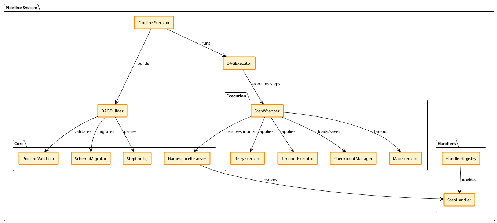
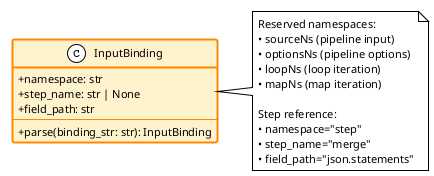
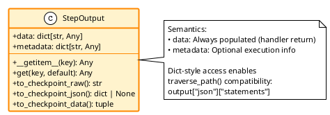
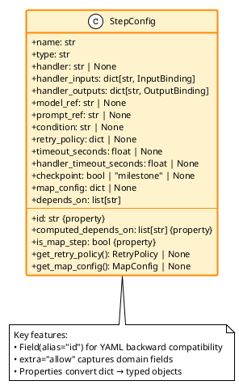
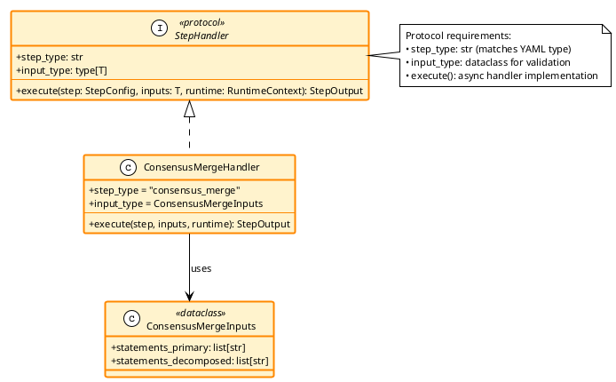
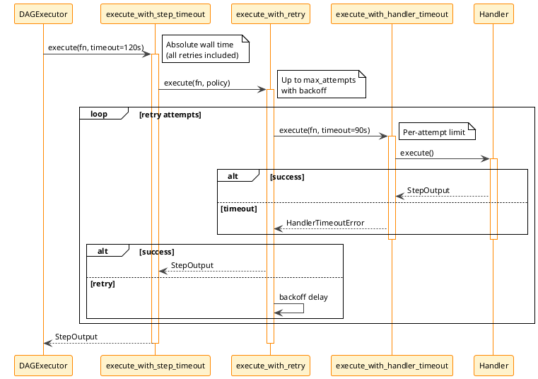
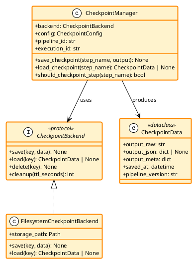
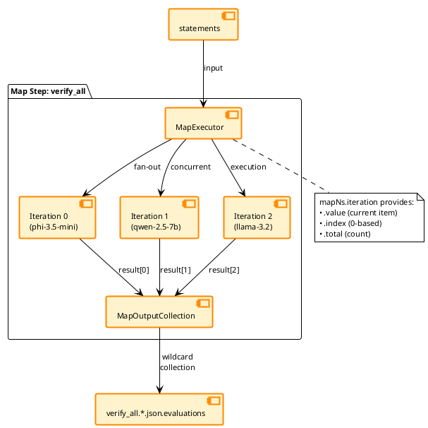

# Pipeline System

Multi-model workflow orchestration with DAG-based execution, explicit object flow, and production-ready features.

## Overview

The pipeline system enables complex workflows that:
- Execute multiple LLM calls with dependency management
- Parallelize independent steps automatically
- Support conditional execution based on previous outputs
- Provide production features: retry, timeout, checkpointing, map/reduce
- Use explicit object-flow for self-documenting dataflow

## Table of Contents

1. [Architecture](#architecture)
2. [Core Concepts](#core-concepts)
3. [Schema Reference](#schema-reference)
   - [v6 Schema Specification](#v6-schema-specification)
4. [Handler Protocol](#handler-protocol)
5. [Production Features](#production-features)
6. [Configuration](#configuration)
7. [Extension Points](#extension-points)
8. [Examples](#examples)
9. [Troubleshooting](#troubleshooting)

---

## Architecture

### Request Flow

```
Pipeline YAML
    ↓
PipelineValidator (parse-time validation)
    ↓
SchemaMigrator (v4→v5 migration)
    ↓
DAGBuilder (construct execution graph)
    ↓
DAGExecutor (topological execution)
    ↓
  for each step:
    ↓
    CheckpointManager (load if exists)
    ↓
    execute_with_step_timeout (optional)
    ↓
    execute_with_retry (optional)
    ↓
    execute_with_handler_timeout (optional)
    ↓
    Handler.execute()
    ↓
    CheckpointManager (save if configured)
    ↓
Output (weave.text, filter.json, etc.)
```

### Component Diagram


<details>
<summary>PlantUML Source Code</summary>



</details>

### Design Principles

| Principle | Description |
|-----------|-------------|
| **Explicit object-flow** | Data moves as named, typed objects with explicit bindings |
| **One-hop code lookup** | Every step has `handler:` pointing to implementation |
| **Computed dependencies** | Dependencies derived from `handler_inputs` bindings |
| **Handler contract** | `handler_inputs` and `handler_outputs` map to handler interface |
| **Namespace isolation** | Reserved namespaces prevent naming conflicts |

---

## Core Concepts

### Object-Flow Architecture

Data moves through the pipeline as named, typed objects with explicit bindings—rather than implicit globals or magic string references. Each step declares what it consumes and produces.

```yaml
steps:
  - name: merge
    type: consensus_merge
    handler: pipelines.consensus.handlers.merge:ConsensusMergeHandler
    handler_inputs:
      statements_primary: generate_primary.json.statements    # ← explicit source
      statements_decomposed: decompose.json.statements        # ← explicit source
    handler_outputs:
      statements: merge.json.statements                       # ← declared output
```

### InputBinding

Binds a handler input field to a data source.


<details>
<summary>PlantUML Source Code</summary>



</details>

**Short-form syntax examples**:

| Binding String | namespace | step_name | field_path |
|---------------|-----------|-----------|------------|
| `sourceNs.text` | sourceNs | None | text |
| `optionsNs.threshold` | optionsNs | None | threshold |
| `merge.json.statements` | step | merge | json.statements |
| `mapNs.iteration.value` | mapNs | None | iteration.value |

### StepOutput

Handler execution result with dict-style access.


<details>
<summary>PlantUML Source Code</summary>



</details>

### StepConfig

Unified step configuration (Pydantic BaseModel).


<details>
<summary>PlantUML Source Code</summary>



</details>

---

## Schema Reference

### Reserved Namespaces

| Namespace | Purpose | Example | Available Where |
|-----------|---------|---------|-----------------|
| `sourceNs.*` | Pipeline input (request data) | `sourceNs.text` | All steps |
| `optionsNs.*` | Pipeline options (configuration) | `optionsNs.consensus_type` | All steps |
| `<step_name>.*` | Step outputs (previous step results) | `merge.json.statements` | Steps after dependency |
| `loopNs.*` | Loop iteration state | `loopNs.iteration`, `loopNs.previous` | Inside loop body only |
| `mapNs.*` | Map iteration state | `mapNs.iteration.value`, `mapNs.iteration.index` | Inside map step only |

### Namespace Quick Reference

```yaml
# ═══════════════════════════════════════════════════════════════════
# NAMESPACE QUICK REFERENCE
# ═══════════════════════════════════════════════════════════════════
#
# sourceNs.*           Pipeline input data
#   sourceNs.text      → Original request text
#   sourceNs.metadata  → Request metadata dict
#
# optionsNs.*          Pipeline configuration options
#   optionsNs.consensus_type   → "percentage" or "unanimous"
#   optionsNs.consensus_value  → threshold float (e.g., 0.8)
#
# <step_name>.*        Previous step outputs
#   merge.text         → Step's text output
#   merge.json.*       → Step's parsed JSON (if applicable)
#   merge.json.statements  → Nested JSON field
#   merge.raw          → Raw handler output string
#
# mapNs.*              Map iteration state
#   mapNs.iteration.value  → Current item value (for list iteration)
#   mapNs.iteration.key    → Current key (for dict iteration)
#   mapNs.iteration.index  → Current index (0-based int)
#   mapNs.iteration.total  → Total number of iterations
#
# Wildcard Collection  Collect from all map iterations
#   verify_all.*.json.evaluations  → [iter0.json.evaluations, iter1.json.evaluations, ...]
#   verify_all.0.json.evaluations  → First iteration result
#   verify_all.-1.json.evaluations → Last iteration result
#
# ═══════════════════════════════════════════════════════════════════
```

### Passing Runtime Options

Pipeline options (`optionsNs.*`) can be provided in two ways:

1. **YAML Defaults** - Static configuration in pipeline file
2. **Runtime HTTP Request** - Dynamic values passed at request time

**Runtime options override YAML defaults.**

#### HTTP Request Format

Pass `pipeline_options` as a top-level field in the request body:

```bash
curl -X POST http://localhost:9999/v1/chat/completions \
  -H "Content-Type: application/json" \
  -d '{
    "model": "my-pipeline",
    "messages": [{"role": "user", "content": "Process this"}],
    "pipeline_options": {
      "consensus_type": "percentage",
      "consensus_value": 0.8,
      "verification_models": ["phi", "qwen", "llama"]
    }
  }'
```

#### YAML Defaults

Configure default options in your pipeline file:

```yaml
options:
  consensus_type: "unanimous"
  consensus_value: 0.9
  verification_models: ["phi", "qwen"]

steps:
  verify:
    handler: VerificationHandler
    handler_inputs:
      type: optionsNs.consensus_type      # Uses runtime or YAML default
      threshold: optionsNs.consensus_value
```

#### Merge Behavior

```python
# Runtime values override YAML defaults
final_options = {**yaml_defaults, **runtime_options}

# Example:
# YAML: {"consensus_value": 0.9, "consensus_type": "unanimous"}
# Runtime: {"consensus_value": 0.8}
# Result: {"consensus_value": 0.8, "consensus_type": "unanimous"}
```

#### Common Mistakes

**❌ Using `extra_body`** (OpenAI Python SDK feature, not HTTP API):
```bash
# WRONG - extra_body is SDK-specific
curl ... -d '{"model": "...", "extra_body": {"pipeline_options": {...}}}'

# CORRECT - pipeline_options at top level
curl ... -d '{"model": "...", "pipeline_options": {...}}'
```

**❌ Invalid Type**:
```bash
# WRONG - pipeline_options must be dict/object
{"pipeline_options": "string"}        # HTTP 400
{"pipeline_options": ["array"]}       # HTTP 400

# CORRECT - dict/object only
{"pipeline_options": {"key": "value"}} # HTTP 200
```

#### Type Safety

- `pipeline_options` **must** be a dict/object
- Invalid types (string, array, number) return **HTTP 400 Bad Request**
- Missing `pipeline_options` uses YAML defaults (backward compatible)
- Empty dict `{}` is valid (uses YAML defaults)

#### Access in Steps

All options accessible via `optionsNs.*` bindings:

```yaml
steps:
  generate:
    handler_inputs:
      threshold: optionsNs.consensus_value
      models: optionsNs.verification_models
      type: optionsNs.consensus_type
```

---

### Conditional Step Execution

Control step execution at runtime using the `condition` field. Steps can be conditionally executed based on runtime options or previous step outputs without modifying YAML.

#### Condition Field

**Syntax**: `condition: "<python-like-expression>"`

Conditions are evaluated in a sandboxed environment before step execution. If the condition evaluates to `False`, the step is skipped.

**Available context:**
- `options.get('key', default)` - Pipeline options (runtime or YAML)
- `step_id.json.get('field')` - Previous step outputs
- Safe functions: `len()`, `bool()`, `str()`, `int()`, `float()`, `min()`, `max()`, `sum()`, `any()`, `all()`, `abs()`
- Operators: `>`, `<`, `==`, `!=`, `and`, `or`, `not`, `in`

**Examples:**

```yaml
steps:
  # Conditional on runtime option
  - name: preprocess
    type: transform
    handler: PreprocessHandler
    condition: "options.get('enable_preprocessing', False)"
  
  # Conditional on previous output
  - name: retry
    type: generate
    handler: RetryHandler
    condition: "len(validate.json.get('errors', [])) > 0"
  
  # Combined logic
  - name: enhance
    type: enhance
    handler: EnhanceHandler
    condition: "options.get('quality_mode') == 'high' and generate.json.get('confidence', 1.0) < 0.9"
```

#### Skip Semantics

**Invariant**: `∀ skipped_step: dependents_become_ready ∧ ¬automatic_skip_propagation`

- Skipped steps satisfy dependencies (downstream steps become ready)
- Dependents must guard against missing inputs using conditions
- Skip propagation is NOT automatic (use conditions on dependents)

**Example skip chain:**

```yaml
- name: validate
  type: validate
  handler: ValidateHandler
  condition: "options.get('enable_validation', True)"
  
- name: fix_issues
  type: fix
  handler: FixHandler
  # Only run if validation ran AND found issues
  condition: "validate.json and len(validate.json.get('issues', [])) > 0"
```

If `validate` is skipped, `fix_issues` will also be skipped (condition evaluates to `False` because `validate.json` is unavailable).

#### Runtime Control

**Pattern**: Define conditions in YAML, control via `pipeline_options` in HTTP request.

```yaml
# Pipeline YAML
options:
  enable_step_a: false
  enable_step_b: true

steps:
  - name: step_a
    condition: "options.get('enable_step_a', False)"
    # ...
  
  - name: step_b
    condition: "options.get('enable_step_b', True)"
    # ...
```

```bash
# HTTP Request - Override defaults
curl -X POST http://localhost:9999/v1/chat/completions \
  -d '{
    "model": "my-pipeline",
    "messages": [...],
    "pipeline_options": {
      "enable_step_a": true,
      "enable_step_b": false
    }
  }'
```

Result: `step_a` runs, `step_b` skips.

#### Security

Conditions execute in sandboxed environment:
- Empty `__builtins__` (no imports, no `exec`, no `eval`)
- Whitelisted safe functions only
- No file I/O or system access
- Evaluation errors default to skip (False) with warning

#### Implementation

**Location**: `core/conditions.py`

**Components**:
- `ConditionEvaluator` - Sandboxed expression evaluation
- `StepOutputProxy` - Safe attribute access with defaults
- Integration in `DAGExecutor._filter_ready_steps()`

**Evaluation flow**:

```
DAGExecutor
  ↓
_filter_ready_steps()
  ↓
_should_execute_step()
  ↓
ConditionEvaluator.evaluate()
  ↓
eval(condition, context) → bool
```

---

### Schema Version

Current: **v6**

```yaml
schema_version: 6
id: my-pipeline-v1
type: custom
```

### v6 Schema Specification

#### Overview

v6 provides explicit, type-safe data flow via `handler_inputs` and `handler_outputs`, replacing implicit dependencies from earlier versions.

**Key Features**:
- Explicit binding paths for data flow
- Automatic dependency computation from bindings
- Type-safe namespace resolution
- Self-documenting pipeline structure

**Key Changes from v4**:
- `inputs:` → `handler_inputs:` (renamed, binding-based)
- `outputs:` → `handler_outputs:` (renamed, binding-based)
- `depends_on:` → removed (computed from `handler_inputs`)
- Explicit binding paths for type-safe data flow

**Benefits**:
- Type-safe binding resolution
- Automatic dependency inference from data flow
- Clear data provenance (where values come from)
- Better error messages (missing bindings detected at parse time)
- Self-documenting pipelines (data flow explicit in YAML)

---

#### handler_inputs Format

**Syntax**: `{input_field_name}: {binding_path}`

- **LEFT side**: Field name passed to handler (arbitrary name you choose)
- **RIGHT side**: Binding path to data source

**Binding Path Components**:
```
namespace.field[.nested_field]
    ↑         ↑         ↑
    |         |         └─ Navigate nested dict/array (optional)
    |         └─ Field: text, json, raw, data, or custom
    └─ Namespace: sourceNs, optionsNs, mapNs, or step name
```

**Reserved Namespaces**:

| Namespace | Purpose | Example | Available Where |
|-----------|---------|---------|-----------------|
| `sourceNs.*` | Pipeline input (user messages) | `sourceNs.text` | All steps |
| `optionsNs.*` | Pipeline configuration | `optionsNs.consensus_value` | All steps |
| `loopNs.*` | Loop iteration context | `loopNs.iteration` | Inside loop body only |
| `mapNs.*` | Map iteration context | `mapNs.iteration.value` | Inside map step only |
| `{step_name}.*` | Previous step outputs | `merge.json.statements` | Steps after dependency |

**Note**: For complete namespace documentation, see [Reserved Namespaces](#reserved-namespaces) and [Namespace Quick Reference](#namespace-quick-reference) sections in this document.

**Examples**:
```yaml
handler_inputs:
  # From pipeline input
  text: sourceNs.text                        # User message content
  metadata: sourceNs.metadata                # Request metadata
  
  # From pipeline options
  threshold: optionsNs.consensus_value       # Config value
  models: optionsNs.verification_models      # Config array
  
  # From previous step outputs
  statements: merge.json.statements          # JSON field
  raw_text: step1.raw                        # Raw output
  prompt_text: rewrite.text                  # Text property
  
  # Nested JSON navigation
  value: config.json.settings.max_retries    # Nested dict
  first_item: list_step.json.items.0         # Array index
  
  # Map iteration
  current_model: mapNs.iteration.value       # Current item
  iteration_index: mapNs.iteration.index     # Index (0-based)
```

**Common Patterns**:
```yaml
# Pattern 1: Access JSON field from previous step
handler_inputs:
  statements: generate.json.statements
  # Resolves to: context.outputs["generate"]["json"]["statements"]

# Pattern 2: Access text output
handler_inputs:
  rewritten_prompt: rewrite.text
  # Resolves to: context.outputs["rewrite"]["text"]

# Pattern 3: Access raw output
handler_inputs:
  full_response: step1.raw
  # Resolves to: context.outputs["step1"]["raw"]

# Pattern 4: Navigate nested JSON
handler_inputs:
  retry_count: config.json.retry_policy.max_attempts
  # Resolves to: context.outputs["config"]["json"]["retry_policy"]["max_attempts"]
```

---

#### handler_outputs Format

**Syntax**: `{output_field_name}: {binding_path}`

- **LEFT side**: Field name that handler returns (must match handler's return dict/object)
- **RIGHT side**: Where to store it (binding path for later access)

> **⚠️ CRITICAL**: The LEFT side must match what your handler actually returns!
> 
> If handler returns `{"statements": [...]}`, declare `statements: step.json.statements`  
> NOT `text: step.json.statements` (field name mismatch)

**Handler Return Contract**:

Handlers can return either `StepOutput` (recommended) or plain dict:

```python
# Pattern 1: StepOutput (recommended)
return StepOutput(
    data={
        "statements": [...],      # Accessible as step.json.statements
        "confidence": 0.95        # Accessible as step.json.confidence
    },
    metadata={...}                # Optional execution metadata
)

# Pattern 2: Plain dict (also supported)
return {
    "statements": [...],          # Accessible as step.json.statements
    "confidence": 0.95
}
```

**Semantic Difference**: 
- `StepOutput.data` → Becomes `step.json` in bindings
- `StepOutput.metadata` → Not accessible in bindings (execution info only)
- Plain dict → Entire dict becomes `step.json`

**YAML Declaration**:
```yaml
handler_outputs:
  statements: generate.json.statements   # Maps data["statements"] → generate.json.statements
  confidence: generate.json.confidence   # Maps data["confidence"] → generate.json.confidence
```

**Examples**:
```yaml
handler_outputs:
  # Store dict field
  statements: generate.json.statements
  # Handler returns: StepOutput(data={"statements": [...]})
  # Accessible as: generate.json.statements
  
  # Store text output
  text: rewrite.text
  # Handler returns: StepOutput(data={"text": "..."})
  # Accessible as: rewrite.text
  
  # Store multiple outputs
  statements: merge.json.statements
  metadata: merge.json.metadata
  # Handler returns: StepOutput(data={"statements": [...], "metadata": {...}})
  # Accessible as: merge.json.statements, merge.json.metadata
  
  # Optional outputs (for conditional/metadata fields)
  backtranslation:
    binding: step.json.backtranslation
    optional: true
  # Handler MAY return this field (no error if missing)
```

**Optional vs Required Outputs**:
- `optional: false` (default) - Handler MUST return this field, error if missing
- `optional: true` - Handler MAY return this field (conditional outputs, metadata)
- Use `optional: true` for: metadata fields, conditional features, fallback values

**Common Mistake** (v4 style - WRONG in v6):
```yaml
# ❌ WRONG (v4 style - backwards!)
handler_outputs:
  text: mystep.raw  # This says handler returns {"text": ...} and stores at .raw

# ✅ CORRECT (v6 style)
handler_outputs:
  raw: mystep.raw   # Handler returns .raw field, stores at mystep.raw
  # OR
  text: mystep.text  # Handler returns .text field, stores at mystep.text
```

---

#### Complete v6 Example

```yaml
schema_version: 6
id: example-pipeline-v1
type: custom
description: "Complete v6 example with explicit data flow"

options:
  threshold: 0.8
  max_iterations: 3

steps:
  # Step 1: Generate (no dependencies)
  - name: generate
    type: generate
    handler: pipeline.handlers.builtin:GenericGenerateHandler
    model_ref: mymodel
    prompt_ref: generation_prompt
    handler_inputs:
      text: sourceNs.text                    # From user input
      threshold: optionsNs.threshold         # From pipeline options
    handler_outputs:
      statements: generate.json.statements   # Store JSON field
    generation_parameters:
      temperature: 1.0
      max_tokens: 2000
      response_format:
        type: json_object
        schema:
          type: object
          properties:
            statements:
              type: array
              items: {type: string}
  
  # Step 2: Verify (depends on generate)
  - name: verify
    type: verification
    handler: pipeline.handlers.verification:VerificationHandler
    model_ref: verifier
    prompt_ref: verification_prompt
    handler_inputs:
      statements: generate.json.statements   # ← Creates dependency on 'generate'
      threshold: optionsNs.threshold
    handler_outputs:
      evaluations: verify.json.evaluations
  
  # Step 3: Aggregate (depends on verify)
  - name: aggregate
    type: aggregate
    handler: pipeline.handlers.aggregate:AggregateHandler
    handler_inputs:
      evaluations: verify.json.evaluations   # ← Creates dependency on 'verify'
      threshold: optionsNs.threshold
    handler_outputs:
      result: aggregate.json.result
      confidence: aggregate.json.confidence

output: aggregate
```

**Dependency Graph** (computed automatically from `handler_inputs`):
```
generate (no deps, starts immediately)
    ↓
verify (depends on generate)
    ↓
aggregate (depends on verify)
```

**Data Flow** (explicit in YAML):
```
sourceNs.text → generate → generate.json.statements → verify → verify.json.evaluations → aggregate → aggregate.json.result
```

---

#### v4/v5 to v6 Migration

**v4 (deprecated)**:
```yaml
steps:
  - id: judge
    type: judge
    inputs: [colloquial, precision]           # List of step names
    depends_on: [colloquial, precision]       # Explicit, redundant!
```

**v6 (current)**:
```yaml
steps:
  - name: judge
    type: judge
    handler_inputs:
      colloquial: colloquial.json.translation   # Binding with field path
      precision: precision.json.translation     # Binding with field path
    # depends_on removed - computed as ['colloquial', 'precision']
```

**What Changed**:
1. `id:` → `name:` (both work via Pydantic Field alias)
2. `inputs: [...]` → `handler_inputs: {...}` (list → dict with bindings)
3. `depends_on: [...]` → removed (computed from `handler_inputs`)
4. Bindings now specify WHICH field to access (`.json.translation`, not just step name)

**Migration Steps**:

1. **Rename fields**:
   ```yaml
   # Before
   id: mystep
   inputs: [step1, step2]
   
   # After
   name: mystep
   # Remove inputs: line
   ```

2. **Convert inputs to handler_inputs**:
   ```yaml
   # Before
   inputs: [colloquial, precision]
   
   # After
   handler_inputs:
     colloquial: colloquial.json.translation  # Specify which field!
     precision: precision.json.translation
   ```

3. **Remove depends_on** (now computed):
   ```yaml
   # Before
   depends_on: [step1, step2]
   
   # After
   # (remove line - computed from handler_inputs)
   ```

4. **Add handler_outputs** (if not present):
   ```yaml
   # After
   handler_outputs:
     translation: mystep.json.translation
     confidence: mystep.json.confidence
   ```

---

#### Common Mistakes

| Mistake | Description | Error Message | Fix |
|---------|-------------|---------------|-----|
| **Backwards handler_outputs** | `text: mystep.raw` (v4 style) | Handler validation error | `raw: mystep.raw` or `text: mystep.text` (LEFT = handler field) |
| **Missing field path** | `handler_inputs: {text: step1}` | `ValueError: Invalid binding 'step1': missing field path` | `handler_inputs: {text: step1.text}` or `step1.json.field` |
| **Using depends_on** | Explicit `depends_on:` list | Warning in logs (removed during migration) | Remove - computed from `handler_inputs` |
| **Wrong namespace** | `handler_inputs: {text: source.text}` | Binding resolution error at runtime | `sourceNs.text` (namespace suffix `Ns` required) |
| **Accessing undefined output** | `step1.json.missing_field` | `KeyError` or binding resolution error | Verify handler returns this field in `data` dict |
| **Template mismatch** | Prompt expects `{rewrite_prompt.text}` but binding is `rewrite_prompt: rewrite_prompt.text` | Template rendering error | Use `{rewrite_prompt}` (binding name = dict key) |
| **Manual template vars** | Trying to set `step.prompt_template_vars` in GenericGenerateHandler subclass | AttributeError | Just call `super().execute()` - see [Extending GenericGenerateHandler](#extending-genericgeneratehandler-with-map-steps) |
| **Wrong map_inputs source** | Reading from `step.handler_inputs` instead of `step.resolved_map_inputs` | Always None | Use `step.resolved_map_inputs` for **template values**, `step.field` for **step attributes** (see [Map Inputs Processing](#map-inputs-step-overrides-vs-template-values)) |
| **Flat generation params** | `temperature: 0.5` at step level | Schema validation error | Use `generation_parameters: {temperature: 0.5}` |
| **Wrong field name** | `generation_config` instead of `generation_parameters` | Field not recognized | Use `generation_parameters` (step-config-only) |
| **Unsupported params** | `extra_body` in generation_parameters | Warning in logs, param filtered | Use only allowed params (see list above) |
| **generation_parameters in prompts.yaml** | Prompt file contains generation_parameters | Validation error | Move to step config |

**Detection Commands**:
```bash
# Find v4-style backwards outputs
grep -r "handler_outputs:" pipelines.local/ --include="*.yaml" -A 2 | \
  grep -E "^\s+\w+:\s+\w+\.(raw|text)$"

# Find missing field paths  
grep -r "handler_inputs:" pipelines.local/ --include="*.yaml" -A 5 | \
  grep -E "^\s+\w+:\s+[^.]+$" | grep -v "Ns\."

# Find legacy depends_on usage
grep -r "^\s*depends_on:" pipelines.local/ --include="*.yaml"
```

---

### generation_parameters Format

**Syntax**: `generation_parameters: {param_name: value}`

Structured dict for model generation parameters (step-config-only).

**Purpose**:
- Single source of truth: step config only
- Explicit separation of step config vs generation params
- Whitelist filtering prevents unsupported parameters
- No prompt-level generation parameters (validation error if found)

**Allowed Parameters**:

| Parameter | Type | Description |
|-----------|------|-------------|
| `temperature` | float | Sampling temperature (0.0-2.0) |
| `max_tokens` | int | Maximum tokens to generate |
| `top_p` | float | Nucleus sampling parameter |
| `top_k` | int | Top-k sampling parameter |
| `stop` | string \| array | Stop sequences |
| `response_format` | dict | JSON schema for structured output |
| `seed` | int | Random seed for reproducibility |
| `presence_penalty` | float | Penalize new tokens based on presence |
| `frequency_penalty` | float | Penalize repeated tokens |
| `stream` | bool | Step-level toggle — pipeline forces `false` for inner generate steps (responses are buffered for step output). Outer-client `stream: true` is honored at the request boundary: see `pipeline_lifecycle._wrap_pipeline_response_as_sse` (final message wrapped as single-chunk SSE). |

**Unsupported Parameters** (filtered with warning):
- `extra_body` - OpenAI SDK meta-parameter
- `extra_headers` - OpenAI SDK meta-parameter
- `extra_query` - OpenAI SDK meta-parameter
- Any custom/undocumented parameters

**Examples**:
```yaml
steps:
  # Basic parameters
  - name: generate
    generation_parameters:
      temperature: 0.7
      max_tokens: 1000
  
  # With JSON schema
  - name: extract
    generation_parameters:
      temperature: 0.3
      max_tokens: 500
      response_format:
        type: json_object
        schema:
          type: object
          properties:
            statements:
              type: array
              items: {type: string}
          required: [statements]
  
  # Advanced sampling
  - name: creative
    generation_parameters:
      temperature: 1.2
      top_p: 0.95
      top_k: 50
      presence_penalty: 0.1
      stop: ["</response>", "\n\n"]
```

**Configuration Hierarchy**:

```
step.generation_parameters["temperature"]
  ↓ (if not set)
None → inference engine default
```

**Same applies to**: `max_tokens` (None → inference engine default)

**Special case**: `response_format` must be set in step config — there is no fallback to prompts.yaml

**Design**: No defaults in pipeline layer. Inference engines (llama.cpp, vLLM) apply their own defaults.

**Filtering Behavior**:

Unsupported parameters are filtered before reaching the model backend:
```yaml
generation_parameters:
  temperature: 0.7
  extra_body: {"custom": "value"}  # ← Filtered, warning logged
  
# Only temperature passed to model
```

**Common Pattern** (step overrides prompt):
```yaml
# prompts.yaml
prompts:
  my_prompt:
    generation_parameters:
      temperature: 0.5  # Default
      max_tokens: 1000

# pipeline.yaml
steps:
  - name: step1
    prompt_ref: my_prompt
    generation_parameters:
      temperature: 1.0  # Override (max_tokens inherited)
```

---

## Handler Protocol

### StepHandler Interface


<details>
<summary>PlantUML Source Code</summary>



</details>

### Handler Implementation Example

```python
from dataclasses import dataclass
from typing import override

@dataclass
class ConsensusMergeInputs:
    """Input schema validated at parse time."""
    statements_primary: list[str]
    statements_decomposed: list[str]

class ConsensusMergeHandler:
    """Handler implementing the execute() protocol."""
    
    step_type = "consensus_merge"
    input_type = ConsensusMergeInputs
    
    @override
    async def execute(
        self,
        step: StepConfig,
        inputs: ConsensusMergeInputs,  # Typed! IDE autocomplete works
        runtime: RuntimeContext
    ) -> StepOutput:
        # Business logic
        merged = self._deduplicate(
            inputs.statements_primary + inputs.statements_decomposed
        )
        
        return StepOutput(
            data={"statements": merged},
            metadata={"handler": "ConsensusMergeHandler"}
        )
```

### YAML Handler Reference

```yaml
- name: merge
  type: consensus_merge
  handler: pipelines.consensus.handlers.merge:ConsensusMergeHandler
  #        └─ Module path: "module.path:ClassName"
  handler_inputs:
    statements_primary: generate_primary.json.statements
    statements_decomposed: decompose.json.statements
  handler_outputs:
    statements: merge.json.statements
    merge_metadata:
      binding: merge.json.merge_metadata
      optional: true
```

### Handler Utilities

#### Parallel Model Calls

For handlers that need to make multiple concurrent model requests, use the utilities in `core/handlers/parallel.py`:

```python
from services.universal_stargate.systems.pipeline.core.handlers import (
    parallel_model_calls,
    parallel_model_calls_with_index,
)

async def execute(self, step: StepConfig, context: PipelineContext) -> StepOutput:
    statements = context.get_input("statements")
    
    # Define verification logic for a single statement
    async def verify_single(stmt: dict) -> dict | None:
        prompt = await self._render_prompt("verify_prompt", stmt, context)
        response = await self._call_model(model_id, prompt, step, context)
        return self._parse_verdict(response, stmt)
    
    # Execute all verifications in parallel
    evaluations = await parallel_model_calls(
        statements,
        verify_single,
        max_concurrency=10,  # Optional: limit concurrent requests
        description="verification",
    )
    
    return StepOutput(data={"evaluations": evaluations})
```

**Features**:
- **Concurrent execution**: Uses `asyncio.TaskGroup` for structured concurrency
- **Optional rate limiting**: Set `max_concurrency` to limit concurrent requests
- **Automatic error handling**: Failed requests logged and filtered (returns None)
- **Result ordering**: Results correspond to input order (with gaps for failures)
- **Type-safe**: Generic TypeVars for input/output types

**Variants**:

| Function | Use Case | Returns |
|----------|----------|---------|
| `parallel_model_calls()` | Simple parallel execution | `list[R]` (filtered) |
| `parallel_model_calls_with_index()` | Track which items succeeded | `list[tuple[int, R]]` (index, result) |

**Benefits**: Reduces boilerplate from 15-20 lines to 3-5 lines per handler.

**Example use case**: Verifying 10 statements by making 10 concurrent single-statement requests, allowing the inference server to batch them efficiently.

### Contract Requirements

| Requirement | Type | Required | Description |
|-------------|------|----------|-------------|
| `step_type` | `str` | ✓ | Class attribute matching YAML `type:` |
| `execute()` | `async (step, context) → StepOutput` | ✓ | Main execution |
| `validate()` | `(step) → list[str]` | ○ | Configuration validation |
| `get_required_placeholders()` | `() → set[str]` | ○ | Template requirements |

### Handler Invariants

- `∀ execute(): returns StepOutput ∧ ¬writes_to_context.outputs`
- Handlers are stateless (instantiated per-execution)
- All I/O must be async

### Implementation Options

See `core/handlers/` for ABCs and protocols:

| Class | Use Case |
|-------|----------|
| `StepHandler` (Protocol) | Duck typing - implement contract implicitly |
| `BaseHandler` (ABC) | Inherits ABC + utility methods (`_call_model`, etc.) |
| `AbstractStepHandler` (ABC) | Explicit contract with full docstrings |

### StepOutput.text Property (CRITICAL)

The `.text` property is **computed**, not a constructor parameter:

```python
# ❌ WRONG - TypeError: unexpected keyword argument 'text'
return StepOutput(raw="x", text="x")

# ✅ CORRECT - Set json["text"] or raw
return StepOutput(raw="content", json={"text": "content"})
```

**Lookup order**:
1. `json["translation"]` (if present)
2. `json["text"]` (if present)
3. `raw` (fallback)

### Registration

Handlers registered via domain router:

```python
# handlers/__init__.py
def register_handlers(router):
    router.register_domain_handler_class("my_domain", "my_step", MyHandler)
```

See `AbstractStepHandler` and `core/handlers/protocol.py` for complete contract documentation.

---

## Production Features

### Retry & Timeout

#### Timeout Hierarchy


<details>
<summary>PlantUML Source Code</summary>



</details>

#### RetryPolicy Configuration

```yaml
retry_policy:
  max_attempts: 3
  backoff_strategy: exponential  # fixed, linear, exponential
  initial_interval_seconds: 2.0
  max_interval_seconds: 300.0
  multiplier: 2.0
  jitter: true                   # ±25% randomization
  retry_on: [Exception]          # Exception types to retry
  dont_retry_on: []              # Exception types to never retry
```

**Backoff Formulas**:

| Strategy | Formula |
|----------|---------|
| Fixed | `delay = initial_interval_seconds` |
| Linear | `delay = initial_interval_seconds × attempt` |
| Exponential | `delay = initial_interval_seconds × (multiplier^(attempt-1))` |

- Cap: `delay = min(delay, max_interval_seconds)`
- Jitter: `delay × random.uniform(0.75, 1.25)`

### Checkpointing


<details>
<summary>PlantUML Source Code</summary>



</details>

#### Checkpoint Configuration

```yaml
checkpoint:
  enabled: true
  strategy: per_step    # per_step, milestone, none
  backend: filesystem
  storage_path: /tmp/pipeline_checkpoints
  ttl_seconds: 86400    # 24 hours
  resume_on_failure: true

steps:
  - name: expensive_step
    checkpoint: milestone  # Override: always checkpoint
  - name: quick_step
    checkpoint: false      # Override: never checkpoint
```

#### Checkpoint Events

| Event | Trigger | Payload |
|-------|---------|---------|
| `CheckpointSaved` | After successful checkpoint write | pipeline_id, execution_id, step_name |
| `CheckpointLoaded` | When cached checkpoint found | pipeline_id, execution_id, step_name |
| `CheckpointFailed` | On checkpoint operation failure | pipeline_id, step_name, error_message |

### Map/Reduce


<details>
<summary>PlantUML Source Code</summary>



</details>

#### MapConfig

MAP is an **execution mode**, not a handler type. Use an explicit handler type (e.g., `generate`) with map fields:

```yaml
- name: verify_all
  type: verification              # ← EXPLICIT handler type (not "map")
  handler: VerificationHandler
  map_over:
    model: optionsNs.verification_models  # ["phi", "qwen", "llama"]
  map_inputs:
    model_ref: mapNs.iteration.value
  handler_inputs:
    statements: merge.json.statements
  timeout_seconds: 30
  min_success_threshold: 0.6  # 60% required
  fail_fast: true
```

**Note**: `type: map` is **not allowed** (validation error). MAP execution is triggered by presence of `map_over`/`map_inputs` fields.

#### Wildcard Collection

```yaml
- name: aggregate
  handler: AggregateHandler
  handler_inputs:
    all_results: verify_all.*.json.evaluations  # Collect all
    first: verify_all.0.json.evaluations        # Indexed access
    last: verify_all.-1.json.evaluations        # Negative index
```

#### Iterating Over Map Step Outputs

You can iterate over outputs from a previous map step using `map_over` with the `step_name.*` syntax:

```yaml
- name: answer_all
  type: generate
  map_over:
    model: optionsNs.answer_models  # Dict: {qwen: qwen, phi: phi, llama: llama}
  handler_outputs:
    text: answer_all.*.raw
  # Produces: answer_all.qwen.raw, answer_all.phi.raw, answer_all.llama.raw

- name: decompose_all
  type: generate
  map_over:
    answer: answer_all.*  # ← Iterate over MapOutputCollection
  map_inputs:
    model_ref: mapNs.iteration.key      # Key from dict (e.g., "qwen")
    answer_text: mapNs.iteration.value.raw  # StepOutput from that key
  handler_outputs:
    statements: decompose_all.*.json.statements
```

**Requirements:**
- Previous step must use **dict-based** `map_over` (not list) to enable key-based iteration
- Use `step_name.*` syntax in `map_over` (wildcard indicates iteration over collection)
- Access `mapNs.iteration.key` for the iteration key (from dict keys)
- Access `mapNs.iteration.value` for the corresponding `StepOutput` object
- Each iteration processes one (key, output) pair in parallel

**Use case:** When each model should process its own output from a previous map step, enabling true parallelism (different models = concurrent execution).

---

## Configuration

### Pipeline Config (stargate_config.yaml)

```yaml
pipelines:
  search_paths:
    - config
    - ~/.local/share/universal-stargate/pipelines
  user_handlers_dir: handlers/  # Relative to config directory
```

### Model References (pipeline_models.yaml)

```yaml
models:
  judge8b:
    model: hermes-llama-3.1-8b-16384
    system_prompt: "You are a helpful assistant."
  phi:
    model: phi-3.5-mini-8192
```

### Prompt Configuration

Prompts are structured YAML with `template` and optional `system_prompt`. Nothing else:

```yaml
prompts:
  consensus.statement_generation:
    description: "Generate discrete statements from question"
    system_prompt: |
      You are an expert at breaking down questions into
      verifiable factual statements.
    template: |
      Question: {question}

      Generate 5-10 discrete, verifiable statements.
```

**Allowed fields**: `description`, `system_prompt`, `template`.

**Forbidden fields** (validated at load time — pipeline fails to start):
- `generation_parameters` — belongs in step config
- `json_schema` — belongs in `generation_parameters.response_format.schema` in step config

**Configuration Hierarchy**:
- `step.generation_parameters["temperature"]` > None (engine default)
- `step.generation_parameters["max_tokens"]` > None (engine default)
- `step.generation_parameters["response_format"]` > None (no fallback)
- `prompt.system_prompt` > `model.system_prompt` > ""

**Note**: No defaults in pipeline layer — inference engines apply their own.

---

## Extension Points

### Custom Handlers

Place handler files in the configured directory:

```python
# ~/.local/share/universal-stargate/handlers/ocr_handlers.py
from systems.pipeline.core.handlers.builtin import BaseHandler
from systems.pipeline.core.handlers.protocol import StepOutput

class OCRDetectHandler(BaseHandler):
    step_type = "detect_issues"
    
    async def execute(self, step, context):
        text = context.source_text
        issues = self._detect_issues(text)
        return StepOutput(raw=issues)

def register_handlers(router):
    """Called by Stargate on startup."""
    router.register_domain_handler_class("ocr", "detect_issues", OCRDetectHandler)
```

### Extending GenericGenerateHandler with Map Steps

**Pattern**: When using `GenericGenerateHandler` (or subclasses) with `map_inputs`, the framework **automatically** merges `resolved_map_inputs` into the prompt context.

**Key Insight**: You don't need to manually handle template variables - just call `super().execute()`.

#### Example: Post-Processing Handler

```python
from systems.pipeline.core.handlers.generate import GenericGenerateHandler
from systems.pipeline.core.handlers.protocol import StepOutput

class FormatParagraphsHandler(GenericGenerateHandler):
    """Reformat prose into structured paragraphs using LLM."""
    
    step_type: str = "format_paragraphs"
    
    async def execute(self, step: StepConfig, context: PipelineContext) -> StepOutput:
        # Validate input exists (populated by MapExecutor via map_inputs)
        if not step.resolved_map_inputs or "prose_text" not in step.resolved_map_inputs:
            raise ValueError("Missing required prose_text in resolved_map_inputs")
        
        prose_text = step.resolved_map_inputs["prose_text"]
        
        # ✅ CORRECT: Just call super() - it automatically merges resolved_map_inputs
        # into prompt context via _build_prompt_context()
        result = await super().execute(step, context)
        
        # Optional: Add validation/fallback logic
        if result.json_data and not result.json_data.get("paragraphs"):
            # Fallback processing
            paragraphs = [p.strip() for p in prose_text.split("\n\n") if p.strip()]
            result = result.model_copy(update={"json_data": {"paragraphs": paragraphs}})
        
        return result
```

#### Pipeline Configuration

```yaml
- name: answer_all
  type: generate
  map_over:
    model: optionsNs.answer_models
  handler_outputs:
    text: answer_all.*.raw  # Maps raw to .text field

- name: format_all
  type: format_paragraphs
  map_over:
    answer: answer_all.*
  map_inputs:
    prose_text: mapNs.iteration.value.text  # ← Automatically available in prompt
  prompt_ref: format_prompt
  handler_outputs:
    paragraphs: format_all.*.json.paragraphs
```

#### Prompt Template

```yaml
prompts:
  format_prompt:
    template: |
      Reformat the following prose into clean paragraphs:
      
      {prose_text}
      
      Return JSON: {{"paragraphs": ["para1", "para2", ...]}}
```

**Data Flow**:
1. `map_inputs` populates `step.resolved_map_inputs["prose_text"]`
2. `GenericGenerateHandler._build_prompt_context()` merges `resolved_map_inputs` into context
3. Template receives `prose_text` automatically via `{prose_text}` placeholder

**Common Mistakes**:

```python
# ❌ WRONG: Trying to manually set template variables
step.prompt_template_vars = {"prose_text": prose_text}  # AttributeError!

# ❌ WRONG: Reading from handler_inputs instead of resolved_map_inputs
prose_text = step.handler_inputs.get("prose_text")  # Always None for map_inputs!

# ✅ CORRECT: Just validate and call super()
if "prose_text" not in step.resolved_map_inputs:
    raise ValueError("Missing prose_text")
result = await super().execute(step, context)
```

**See**: `core/handlers/generate.py` lines 190-261 for `_build_prompt_context()` implementation.

---

### Map Inputs: Step Overrides vs Template Values

When using `map_inputs` in map steps, the `MapExecutor` distinguishes between two types of fields:

| Field Type | Detection | Storage | Access Pattern | Example |
|-----------|-----------|---------|---------------|---------|
| **Step Config Attribute** | `hasattr(step, field)` | Direct override on `StepConfig` | `step.field_name` | `model_ref`, `generation_parameters` |
| **Template Placeholder** | Not a step attribute | `step.resolved_map_inputs` | `step.resolved_map_inputs["field"]` | `prose_text`, `paragraphs`, `statements` |

#### How It Works

The `MapExecutor._create_iteration_step()` method processes `map_inputs` as follows:

1. **For each field in `map_inputs`:**
   - If field exists on `StepConfig` (e.g., `model_ref`, `prompt_ref`, `generation_parameters`) → **overrides step attribute directly**
   - Otherwise → **stores in `resolved_map_inputs` dictionary**

2. **Special handling:**
   - `generation_parameters`: **merges** with step-level params instead of replacing
   - Pool-assigned models: Applied as `model_ref` if not explicitly overridden

#### Handler Implementation Patterns

```python
# ✅ CORRECT: Accessing step config attributes (overridden directly)
model_ref = step.model_ref  # Already overridden by MapExecutor
prompt_ref = step.prompt_ref  # Already overridden by MapExecutor

# ✅ CORRECT: Accessing template values (stored in resolved_map_inputs)
paragraphs = step.resolved_map_inputs.get("paragraphs")
statements = step.resolved_map_inputs.get("statements")

# ❌ WRONG: Trying to get step config attributes from resolved_map_inputs
model_ref = step.resolved_map_inputs.get("model_ref")  # Always None!
```

#### Example: Dynamic Model Selection

**Pipeline Config:**
```yaml
- name: decompose_all
  type: consensus_decompose_paragraphs_v3_3
  model_ref: phi  # Fallback
  map_over:
    answer: format_paragraphs_all.*
  map_inputs:
    model_ref: optionsNs.decompose_mapping[mapNs.iteration.key]  # Step attribute
    paragraphs: mapNs.iteration.value.json.paragraphs  # Template value
```

**Handler:**
```python
class DecomposeParagraphsHandler(BaseHandler):
    async def execute(self, step: StepConfig, context: PipelineContext) -> StepOutput:
        # ✅ CORRECT: model_ref is step attribute, overridden by MapExecutor
        model_ref = step.model_ref
        
        # ✅ CORRECT: paragraphs is template value, stored in resolved_map_inputs
        paragraphs = step.resolved_map_inputs.get("paragraphs", [])
        
        # Use model_ref and paragraphs for processing...
```

#### Detection

To check if a field is a step config attribute:

```bash
# Find StepConfig fields
rg "class StepConfig" services/universal-stargate/systems/pipeline/core/schemas.py -A 50 | \
  grep "^\s\+\w\+:" | cut -d: -f1 | xargs
```

Common step config attributes: `model_ref`, `prompt_ref`, `generation_parameters`, `config`, `handler_inputs`, `handler_outputs`, `map_over`, `map_inputs`

**See**: `core/execution/map_reduce/executor.py` lines 1176-1248 for `_create_iteration_step()` implementation.

---

### Entry Points (Package-based)

```toml
[project.entry-points."stargate.domains"]
my_domain = "my_package:register_handlers"
```

---

## Examples

### Complete Pipeline Example

```yaml
schema_version: 6
id: consensus-basic-v1
type: consensus
description: "Multi-model consensus with explicit object flow"

checkpoint:
  enabled: true
  strategy: per_step
  storage_path: /tmp/consensus_checkpoints
  ttl_seconds: 86400

options:
  consensus_type: percentage
  consensus_value: 0.8
  verification_models:
    - phi-3.5-mini
    - qwen-2.5-7b

steps:
  # Step 1: Rewrite question
  - name: rewrite_prompt
    type: generate
    handler: pipeline.handlers.builtin:GenericGenerateHandler
    model_ref: judge8b
    prompt_ref: consensus.prompt_rewrite
    handler_inputs:
      text: sourceNs.text
    handler_outputs:
      text: rewrite_prompt.text
    retry_policy:
      max_attempts: 2
      backoff_strategy: exponential

  # Step 2: Generate primary statements
  - name: generate_primary
    type: consensus_generation
    handler: pipelines.consensus.handlers.generation:ConsensusGenerationHandler
    model_ref: judge8b
    handler_inputs:
      question: rewrite_prompt.text
    handler_outputs:
      statements: generate_primary.json.statements
    timeout_seconds: 120
    checkpoint: milestone

  # Step 3: Verify with multiple models (Map)
  - name: verify_all
    type: verification              # ← EXPLICIT handler type (not "map")
    handler: pipelines.consensus.handlers.verification:ConsensusVerificationHandler
    map_over:
      model: optionsNs.verification_models
    map_inputs:
      model_ref: mapNs.iteration.value
    handler_inputs:
      statements: generate_primary.json.statements
    handler_outputs:
      evaluations: verify_all.json.evaluations
    timeout_seconds: 60
    min_success_threshold: 0.6
    retry_policy:
      max_attempts: 2

  # Step 4: Aggregate results (Reduce)
  - name: aggregate
    type: consensus_aggregate
    handler: pipelines.consensus.handlers.aggregate:AggregateHandler
    handler_inputs:
      all_evaluations: verify_all.*.json.evaluations
      threshold: optionsNs.consensus_value
    handler_outputs:
      consensus_statements: aggregate.json.consensus_statements

  # Step 5: Weave final answer
  - name: weave
    type: consensus_weaving
    handler: pipelines.consensus.handlers.weaving:ConsensusWeavingHandler
    model_ref: judge8b
    handler_inputs:
      consensus_statements: aggregate.json.consensus_statements
    handler_outputs:
      text: weave.text

output: weave.text
```

---

## Troubleshooting

### Validation Script (Run First)

**Before debugging runtime issues, run the validation script:**

```bash
python scripts/validate-pipeline.py pipelines.local/{domain}/
```

The validator checks:
- ✅ Pipeline structure (schema version, dependencies, parameters)
- ✅ **prompts.yaml** (catches `system:` instead of `system_prompt:`, missing `template`, etc.)
- ✅ **models.yaml** (catches `model_id:` instead of `model:`, missing required fields, etc.)
- ✅ Handler inputs/outputs (valid namespaces, correct format)

Example output:
```
✓ pipelines.local/erotica/episode-main.yaml [pipeline]
✗ pipelines.local/erotica/prompts.yaml [prompts config]
  │ Prompt 'main_episode': Found 'system' field. Did you mean 'system_prompt'?
```

### Pipeline not loading

1. **Run validator first**: `python scripts/validate-pipeline.py pipelines.local/{domain}/`
2. Check YAML exists in configured search_paths
3. Verify model refs exist in pipeline_models.yaml
4. Check validation errors in logs

### Handler not found

1. Verify handler registered for (domain, step_type)
2. Check `register_handlers()` function exists in handler file
3. For packages: verify entry point in pyproject.toml

### Step skipped unexpectedly

1. Check `condition` expression syntax
2. Verify referenced step outputs exist
3. Check condition evaluation logs

### Pipeline deadlock

1. Check if all pending tasks are being processed
2. Look for "waiting for model" messages
3. Review batch routing logs for conflicts

### Sequential instead of parallel execution

1. Verify steps with different models assigned correctly
2. Check batch routing logs: "X assigned, Y deferred"
3. Ensure steps don't have unnecessary dependencies

---

## Module Structure

| Directory | Purpose |
|-----------|---------|
| `core/` | Domain-agnostic infrastructure |
| `core/schemas.py` | Data models: StepConfig, bindings, checkpoints (~400 SLOC) |
| `core/validation.py` | Parse-time validation (~80 SLOC) |
| `core/migration.py` | Schema v4→v5 migration (~70 SLOC) |
| `core/execution/` | Runtime execution layer |
| `core/execution/resolver.py` | Namespace resolution + path traversal (~180 SLOC) |
| `core/execution/retry.py` | Retry policy and execution (~100 SLOC) |
| `core/execution/timeout.py` | Step/handler timeout enforcement (~80 SLOC) |
| `core/execution/step_wrapper.py` | Wrapper composition (~120 SLOC) |
| `core/execution/checkpoint/` | Checkpoint subsystem |
| `core/execution/map_reduce/` | Map/reduce execution |
| `core/handlers/` | Handler protocol and registry |

---

## See Also

- `README_AI.md` - AI agent navigation guide with formal invariants
- `QUICKSTART.md` - Tutorial for creating pipelines
- `core/execution/README_AI.md` - Execution subsystem details
